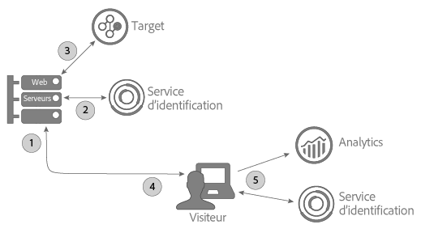

# Utilisation du service ID avec A4T et une mise en œuvre côté serveur de Target {#using-the-id-service-with-a-t-and-a-server-side-implementation-of-target}

Ces instructions concernent les clients A4T avec un serveur mixte, pour la mise en œuvre de Target, Analytics et du service d’ID côté client. Les clients qui ont besoin d’exécuter le service d’ID dans un environnement NodeJS ou Rhino doivent également consulter ces informations. Cette instance du service d’ID utilise une version raccourcie de la bibliothèque de code VisitorAPI.js, que vous téléchargez et installez à partir de Node Package Manager (NPM). Consultez cette section pour obtenir des instructions relatives à l’installation et d’autres conditions préalables de configuration..

## Introduction {#section-ab0521ff5bbd44c592c3eaab31c1de8b}

Les clients A4T (et les autres) peuvent utiliser cette version du service d’ID lorsqu’ils ont besoin d’effectuer les actions suivantes :

* Afficher du contenu de page Web sur leurs serveurs et le transmettre à un navigateur pour l’affichage final.
* Lancer des appels [!DNL Target] côté serveur.
* Lancer des appels côté client (dans le navigateur) à [!DNL Analytics].
* Synchroniser différents identifiants [!DNL Target] et [!DNL Analytics] pour déterminer si un visiteur identifié par une solution est la même personne que celle identifiée par une autre solution.

## Téléchargement du code et interfaces fournies {#section-32d75561438b4c3dba8861be6557be8a}

Voir le [référentiel NPM du service d’ID](https://www.npmjs.com/package/@adobe-mcid/visitor-js-server) pour télécharger le package de code côté serveur et consulter les interfaces incluses dans la version actuelle.

## Workflow {#section-56b01017922046ed96536404239a272b}

Le diagramme et les sections ci-dessous décrivent le déroulement et les éléments à configurer de chaque étape du processus de mise en œuvre côté serveur.



## Étape 1 : Page de demande {#section-c12e82633bc94e8b8a65747115d0dda8}

L’activité côté serveur commencer lorsqu’un visiteur fait une demande HTTP de chargement d’une page Web. Lors de cette étape, votre serveur reçoit cette demande et vérifie [Cookie AMCV](../introduction/cookies.md). Le cookie AMCV contient l’[!DNL Experience Cloud] ID (MID) du visiteur.

## Étape 2 : Génération des données utiles du service d’ID {#section-c86531863db24bd9a5b761c1a2e0d964}

Ensuite, vous devez effectuer une *`payload request`* côté serveur auprès du service d’ID. Une demande de données utiles :

* Transmet le cookie AMCV au service d’ID.
* Demande les données requises par Target et Analytics dans les étapes suivantes décrites ci-dessous.

>[!NOTE]
>
>Cette méthode demande une mbox unique depuis [!DNL Target]. Si vous avez besoin de demander plusieurs mboxes dans un seul appel, voir [generateBatchPayload](https://www.npmjs.com/package/@adobe-mcid/visitor-js-server#generatebatchpayload).

Votre demande de données utiles doit ressembler à l’exemple de code suivant. Dans l’exemple de code, la fonction `visitor.setCustomerIDs` est optionnelle. Pour plus d’informations, voir [ID de client et états de l’authentification.](../reference/authenticated-state.md)

```js
//Import the ID service server package 
var Visitor = require("@adobe-mcid/visitor-js-server"); 
 
//Pass in your Organization ID to instantiate Visitor 
var visitor = new Visitor("Insert Experience Cloud ID here"); 
 
// 
<i>(Optional)</i> Set a custom customer ID 
visitor.setCustomerIDs({ 
     userid:{ 
          id:"1234", 
          authState: Visitor.AuthState.UNKNOWN //AuthState is a static property of the Visitor class 
     } 
}); 
 
//Parse the visitor's HTTP request for the AMCV cookie 
var cookies = cookie.parse(req.headers.cookie || ""); 
var cookieName = visitor.getCookieName(); // Visitor API that returns the cookie name. 
var amcvCookie = cookies[cookieName]; 
 
//Generate the payload request pass your mbox name and the AMCV cookie if present 
var visitorPayload = visitor.generatePayload({ 
     mboxName: "bottom-banner-mbox", 
     amcvCookie: amcvCookie 
});
```

Le service d’ID renvoie les données utiles dans un objet JSON similaire à l’exemple suivant. Les données utiles sont requises par [!DNL Target].

```js
{ 
    "marketingCloudVisitorId": "02111696918527575543455026275721941645", 
    "mboxParameters": { 
        "mboxAAMB": "abcd1234", 
        "mboxMCGLH": "9", 
        "mboxMCSDID": "56BE026543F7E211-1CC51BCAAE88F0D2", 
        "vst.userid.id": "1234567890", 
        "vst.userid.authState": 0 
    } 
}
```

Si votre visiteur n’a pas de cookie AMCV, les données utiles omettent ces paires clés-valeurs :

* `marketingCloudvisitorId`
* `mboxAAMB`
* `mboxMCGLH`

## Étape 3 : Ajout des données utiles dans l’appel Target {#section-62451aa70d2f44ceb9fd0dc2d4f780f7}

Une fois que votre serveur a reçu les données utiles de la part du service d’ID, vous devez instancier du code supplémentaire pour le fusionner avec les données transmises à [!DNL Target]. L’objet JSON final transmis à [!DNL Target] peut ressembler à cela :

```js
{ 
"mbox" : "target-global-mbox", 
"marketingCloudVisitorId":"02111696918527575543455026275721941645", 
"requestLocation" : { 
     "pageURL" : "http://www.domain.com/test/demo.html", 
     "host" : "localhost:3000" 
     }, 
"mboxParameters" : { 
     "mboxAAMB" : "abcd1234", 
     "mboxMCGLH" : "9", 
     "mboxMCSDID": "56BE026543F7E211-1CC51BCAAE88F0D2", 
     "vst.userid.id": "1234567890", 
     "vst.userid.authState": 0, 
     } 
} 
```

## Étape 4 : Obtention de l’état du serveur depuis le service d’ID {#section-8ebfd177d42941c1893bfdde6e514280}

Les données sur l’état du serveur contiennent des informations sur le travail effectué par le serveur. Le code du service d’ID côté client nécessite ces informations. Les clients qui ont mis en œuvre le service d’ID via [!DNL Dynamic Tag Manager] (DTM) peuvent configurer DTM pour transmettre des données sur l’état du serveur via cet outil. Si vous avez configuré le service d’ID via un processus non standard, vous devrez renvoyer l’état du serveur avec votre propre code. Le code du service d’ID et d’[!DNL Analytics] côté client transmet des données sur l’état à Adobe lors du chargement de la page.

**Obtention de l’état du serveur via DTM**

Si vous avez mis en œuvre le service d’ID avec DTM, vous avez besoin d’ajouter du code à votre page et de définir une paire nom-valeur dans les paramètres DTM.

**Code page**

Ajoutez ce code dans la balise `<head>` de votre page HTML :

```js
//Get server state 
var serverState = visitor.getState(); 
 
Response.send(" 
... 
<head> 
     <script> 
          //Add 'serverState' as a stringified JSON global variable. 
          "var serverState = "+ JSON.stringify(serverState) +";  
     </script> 
     <script src = "DTM script (satellite JS)"> 
     </script> 
</head> 
...
```

**Paramètres DTM**

Ajoutez-les en tant que paires noms-valeurs dans la section **[!UICONTROL Général &gt; Paramètres]** de votre instance de service :

* **[!UICONTROL Nom :]** serverState
* **[!UICONTROL Valeur :]** %serverState%

   >[!IMPORTANT]
   >
   >Le nom de la valeur doit correspondre au nom de la variable que vous définissez pour `serverState` dans le code de votre page.

Voici à quoi doivent ressembler vos paramètres configurés :


Voir également [Paramètres du service Experience Cloud Identity pour DTM](../implementation-guides/standard.md#concept-fb6cb6a0e6cc4f10b92371f8671f6b59).

**Obtention de l’état du serveur sans DTM**

Si vous avez effectué une mise en œuvre non standard du service d’ID, vous devez configurer ce code de manière à l’exécuter sur votre serveur pendant qu’il assemble la page demandée :

```js
//Get server state 
var serverState = visitor.getState(); 
 
Response.send(" 
... 
<head> 
     <script src="VisitorAPI.js"></script> 
     <script> 
          var visitor = Visitor.getInstance(orgID, { 
          serverState: serverState  
          ... 
     </script> 
</head> 
...
```

## Étape 5 : Servir une page et renvoyer les données Experience Cloud {#section-4b5631a0d75a41febd6f43f8c214c263}

À cette étape, le serveur Web envoie le contenu de la page dans le navigateur du visiteur. À partir de là, le navigateur (et non le serveur) lance tous les appels restants du service d’ID et d’[!DNL Analytics]. Par exemple, dans le navigateur :

* Le service d’ID reçoit les données d’état à partir du serveur et transmet le SDID à AppMeasurement.
* AppMeasurement envoie les données sur l’accès à la page à [!DNL Analytics], y compris le SDID.
* [!DNL Analytics] et [!DNL Target] comparent les SDID de ce visiteur. Si le SDID est identique, [!DNL Target] et [!DNL Analytics] réunissent l’appel côté serveur et l’appel côté client. À cette étape, les deux solutions reconnaissent désormais ce visiteur, qui est une seule et même personne.

>[!MORE_LIKE_THIS]
>
>* [Package du service d’ID côté serveur à partir de Node Package Manager](https://www.npmjs.com/package/@adobe-mcid/visitor-js-server)

