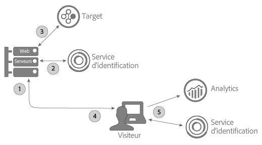

# Utilisation du service d’identification des visiteurs avec A4T et une mise en œuvre côté serveur de Target {#using-the-id-service-with-a-t-and-a-server-side-implementation-of-target}

Ces instructions s’adressent aux clients A4T avec des implémentations mixtes de Target, d’Analytics et du service d’identification des visiteurs, à la fois côté serveur et côté client. Les clients qui doivent exécuter le service d’identification des visiteurs dans un environnement NodeJS ou Rhino doivent également consulter ces informations. Cette instance du service d’identification des visiteurs utilise une version abrégée de la bibliothèque de code `VisitorAPI.js`, que vous pouvez télécharger et installer à partir de Node Package Manager (NPM). Consultez cette section pour connaître les instructions d’installation et les autres exigences de configuration.

## Introduction {#section-ab0521ff5bbd44c592c3eaab31c1de8b}

A4T (et d’autres clients) peut utiliser cette version du service d’identification des visiteurs lorsqu’ils ont besoin de :

* Générer le contenu d’une page web sur leurs serveurs et le transmettre à un navigateur pour l’affichage final.
* Effectuer des appels Target côté serveur.
* Effectuer des appels côté client (dans le navigateur) vers Analytics.
* Synchronisez des identifiants Target et Analytics distincts pour déterminer si un visiteur affiché par une solution correspond à la même personne que celle affichée par l’autre solution.

## Téléchargement du code et interfaces fournies {#section-32d75561438b4c3dba8861be6557be8a}

Consultez le [référentiel NPM du service d’identification des visiteurs](https://www.npmjs.com/package/@adobe-mcid/visitor-js-server) pour télécharger le package de code côté serveur et consulter les interfaces incluses dans la version actuelle.

## Workflow {#section-56b01017922046ed96536404239a272b}

Le diagramme ainsi que les sections ci-dessous décrivent le déroulement et les éléments à configurer de chaque étape du processus d’implémentation côté serveur.



## Étape 1 : demande de page {#section-c12e82633bc94e8b8a65747115d0dda8}

L’activité côté serveur commencer lorsqu’un visiteur fait une demande HTTP de chargement d’une page Web. Au cours de cette étape, votre serveur reçoit cette demande et vérifie le [cookie AMCV](../introduction/cookies.md). Le cookie AMCV contient l’ECID du visiteur.

## Étape 2 : générer la payload du service d’identification des visiteurs {#section-c86531863db24bd9a5b761c1a2e0d964}

Ensuite, vous devez effectuer une *`payload request`* côté serveur au service d’identification des visiteurs. Une demande de payload :

* Transmet le cookie AMCV au service d’identification des visiteurs.
* Demande les données requises par Target et Analytics lors d’étapes ultérieures décrites ci-dessous.

>[!NOTE]
>
>Cette méthode demande une mbox unique à Target. Si vous devez demander plusieurs mbox au cours d’un seul appel, voir [generateBatchPayload](https://www.npmjs.com/package/@adobe-mcid/visitor-js-server#generatebatchpayload).

Votre demande de données utiles doit ressembler à l’exemple de code suivant. Dans l’exemple de code, la fonction `visitor.setCustomerIDs` est optionnelle. Pour plus d’informations, voir [ID de client et états de l’authentification.](../reference/authenticated-state.md)

```js
//Import the Visitor ID Service server package 
var Visitor = require("@adobe-mcid/visitor-js-server"); 
 
//Pass in your IMS org ID to instantiate Visitor 
var visitor = new Visitor("Insert ECID here"); 
 
// 
<i>(Optional)</i> Set a custom customer ID 
visitor.setCustomerIDs({ 
     userid:{ 
          id:"1234", 
          authState: Visitor.AuthState.UNKNOWN //AuthState is a static property of the Visitor class 
     } 
}); 
 
//Parse the visitor's HTTP request for the AMCV cookie 
var cookies = cookie.parse(req.headers.cookie || ""); 
var cookieName = visitor.getCookieName(); // Visitor API that returns the cookie name. 
var amcvCookie = cookies[cookieName]; 
 
//Generate the payload request pass your mbox name and the AMCV cookie if present 
var visitorPayload = visitor.generatePayload({ 
     mboxName: "bottom-banner-mbox", 
     amcvCookie: amcvCookie 
});
```

Le service d’identification des visiteurs renvoie la payload dans un objet JSON similaire à l’exemple suivant. Les données de payload sont requises par Target.

```js
{ 
    "marketingCloudVisitorId": "02111696918527575543455026275721941645", 
    "mboxParameters": { 
        "mboxAAMB": "abcd1234", 
        "mboxMCGLH": "9", 
        "mboxMCSDID": "56BE026543F7E211-1CC51BCAAE88F0D2", 
        "vst.userid.id": "1234567890", 
        "vst.userid.authState": 0 
    } 
}
```

Si votre visiteur n’a pas de cookie AMCV, les données utiles omettent ces paires clés-valeurs :

* `marketingCloudvisitorId`
* `mboxAAMB`
* `mboxMCGLH`

## Étape 3 : ajout de la payload dans l’appel Target {#section-62451aa70d2f44ceb9fd0dc2d4f780f7}

Une fois que votre serveur reçoit les données de payload du service d’identification des visiteurs, vous devez instancier du code supplémentaire pour le fusionner avec les données transmises à Target. L’objet JSON final transmis à Target ressemblerait à ceci :

```js
{ 
"mbox" : "target-global-mbox", 
"marketingCloudVisitorId":"02111696918527575543455026275721941645", 
"requestLocation" : { 
     "pageURL" : "http://www.domain.com/test/demo.html", 
     "host" : "localhost:3000" 
     }, 
"mboxParameters" : { 
     "mboxAAMB" : "abcd1234", 
     "mboxMCGLH" : "9", 
     "mboxMCSDID": "56BE026543F7E211-1CC51BCAAE88F0D2", 
     "vst.userid.id": "1234567890", 
     "vst.userid.authState": 0, 
     } 
} 
```

## Étape 4 : obtention de l’état du serveur pour le service d’identification des visiteurs {#section-8ebfd177d42941c1893bfdde6e514280}

Les données d’état du serveur contiennent des informations sur le travail effectué sur le serveur. Le code du service d’identification des visiteurs côté client nécessite ces informations. Si vous avez configuré le service d’identification des visiteurs par le biais d’un processus non standard, vous devrez renvoyer l’état du serveur avec votre propre code. Le service d’identification des visiteurs côté client et le code Analytics transmettent des données d’état à Adobe lors du chargement de la page.

Si vous disposez d’une mise en œuvre non standard du service d’identification des visiteurs, vous devez configurer ce code pour qu’il s’exécute sur votre serveur pendant qu’il assemble la page demandée :

```js
//Get server state 
var serverState = visitor.getState(); 
 
Response.send(" 
... 
<head> 
     <script src="VisitorAPI.js"></script> 
     <script> 
          var visitor = Visitor.getInstance(orgID, { 
          serverState: serverState  
          ... 
     </script> 
</head> 
...
```

## Étape 5 : servir une page et renvoyer les données CX Enterprise {#section-4b5631a0d75a41febd6f43f8c214c263}

À cette étape, le serveur Web envoie le contenu de la page dans le navigateur du visiteur. À partir de ce moment, le navigateur (et non le serveur) effectue tous les appels du service d’identification des visiteurs et d’Analytics restants. Par exemple, dans le navigateur :

* Le service d’identification des visiteurs reçoit les données d’état du serveur et transmet le SDID à AppMeasurement.
* AppMeasurement envoie des données sur l’accès à la page à Analytics, y compris le SDID.
* Analytics et Target comparent les SDID de ce visiteur. Avec un SDID identique, Target et Analytics assemblent l’appel côté serveur et l’appel côté client. À cette étape, les deux solutions reconnaissent désormais ce visiteur, qui est une seule et même personne.

>[!MORELIKETHIS]
>
>* [Package de service d’identifiant visiteur côté serveur à partir du gestionnaire de packages Node](https://www.npmjs.com/package/@adobe-mcid/visitor-js-server)

