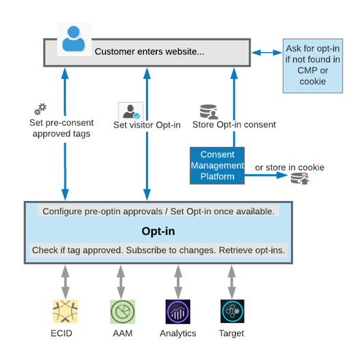

# Service de souscription{#opt-in-service}

Le service de souscription vous permet de configurer des protocoles pour que le visiteur détermine si vous pouvez définir un cookie sur le périphérique ou le navigateur de l&#39;utilisateur lors de la visite de votre site.

Le service de souscription est une extension du service [Experience Cloud ID (ECID)](https://marketing.adobe.com/resources/help/en_US/mcvid/) , conçue pour vous permettre de contrôler si les solutions Experience Cloud peuvent créer des cookies dans les pages Web pour les visiteurs avant leur autorisation. Le service de souscription vous permet également de définir des protocoles pour l&#39;intégration à votre plateforme de gestion des autorisations (CMP) et aux systèmes existants dans le cadre de votre conception plus grande.

Grâce au service de souscription, vous pouvez spécifier si un visiteur peut s&#39;abonner à des solutions Adobe à la fois ou présenter des solutions dans l&#39;ordre pour les autorisations. Une fois le processus d’approbation terminé et enregistré par le client, vous pouvez récupérer les approbations visiteur de la CMP de l’ensemble des solutions Adobe.

Le service de souscription est mis en œuvre et configuré facilement à l&#39;aide [d&#39;Adobe Launch](https://docs.adobelaunch.com/) avec l&#39;extension [de souscription](../../implementation-guides/opt-in-service/launch.md). Elle peut également être implémentée et configurée à l&#39;aide [de la gestion dynamique](../../implementation-guides/opt-in-service/optin-dtm.md)des balises.

Pour commencer, reportez-vous à [la section Définition du service](../../implementation-guides/opt-in-service/getting-started.md) de souscription - Up Service.

>[!NOTE]
>
>Le service de souscription vous permet de configurer un système pour approuver ou refuser le téléchargement des cookies Adobe uniquement. Celui-ci ne perrmet pas de rassembler les préférences utilisateur en matière de consentement, ni ne constitue un référentiel de préférences.

>[!IMPORTANT]
>
>Le contenu de ce document n&#39;est pas un avis juridique et ne peut pas être remplacé par des conseils juridiques. Adressez-vous au service juridique de votre société pour obtenir des conseils en ce qui concerne le consentement et les pratiques quant à la configuration de la mise en œuvre de l’opt-in.

## Opt-in et les diverses solutions Experience Cloud {#section-053e6224505542cf961896f0ca869e52}

Le service de souscription est un outil permettant de créer un acceptation de consentement dans le flux de travail en fonction de vos besoins, ce qui vous permet de concevoir un flux de travail pour réagir (de déclencher des balises) avant et après le consentement de l&#39;utilisateur ou de votre contrôleur de consentement.

Le service d&#39;inclusion vous permet de configurer les pratiques de gestion du consentement pour les solutions Adobe à :

* Indiquer si les conditions de collecte des consentements s’appliquent de manière générale à un utilisateur.
* Indiquer, parmi les solutions, lesquelles sont autorisées à générer des cookies.
* Appliquer les préférences par défaut pour chacune des solutions dont l’utilisateur n’a pas explicitement consenti ou refusé la catégorie.
* Déclencher une réponse personnalisée basée sur les modifications apportées aux paramètres de consentement de l’utilisateur, vous permettant de conserver ou de mettre à jour les paramètres dudit utilisateur.

A l&#39;aide des services de souscription, vous pouvez configurer votre site afin que certains cookies soient chargés avec le pré-consentement avant le choix de l&#39;utilisateur. Vous pouvez définir des services de souscription pour que les nouveaux clients puissent autoriser le chargement des cookies après que l&#39;utilisateur a accepté ou qu&#39;une sélection soit disponible. Vous pouvez également stocker et récupérer les consentements sur votre plate-forme de gestion de contenu, ou simplement stocker les autorisations d’opt-in dans un cookie.

Les solutions Adobe peuvent alors vérifier que la balise est approuvée, s’abonner aux modifications, puis récupérer l’ensemble des clients opt-in. Le service de souscription vous permet d&#39;obtenir des autorisations directement via les bibliothèques JavaScript de la solution ou via ECID, si elles sont implémentées.
