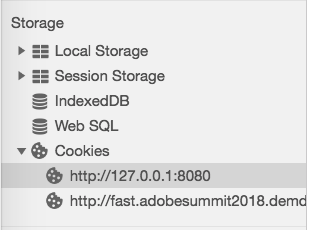

# Validation du service Opt-in{#validating-opt-in-service}

Une fois le service Opt-in activé sur votre site web, utilisez les différentes méthodes de validation afin de vérifier que celui-ci fonctionne correctement, à l’aide des outils de développement de votre navigateur.

## Cas d’utilisation 1 : activer Opt-in {#section-c8fe1ee3711b420c8186c7057abbecb3}

```
Visitor.getInstance({{YOUR_ORG_ID}}, { 
    doesOptInApply: true 
});
```


Avant de charger la page, effacez votre cache et vos cookies.

Dans Chrome, cliquez sur la page web avec le bouton droit de la souris, puis cliquez sur Inspecter. Comme dans la capture dʼécran ci-dessus, sélectionnez lʼonglet *Réseau* pour afficher les requêtes effectuées à partir du navigateur.

Dans lʼexemple ci-dessus, les balises JS dʼAdobe suivantes sont installées sur la page : ECID, AAM, Analytics et Target.

**Comment voir si Opt-in fonctionne comme prévu ?**

Aucune requête vers les serveurs Adobe ne doit sʼafficher :

* demdex.net/id
* demdex.net/event
* omtrdc.net/b/ss
* omtrdc.net/m2
* everesttech.net

>[!NOTE]
>
>Vous devez voir un appel vers `http://dpm.demdex.net/optOutStatus`, un point d’entrée en LECTURE SEULE utilisé pour récupérer l’état de désinscription du visiteur. Ce point dʼentrée nʼentraîne la création dʼaucun cookie tiers et ne collecte aucune information sur la page.

Vous ne devriez pas voir de cookies créés par les balises Adobe : (`AMCV_{{YOUR_ORG_ID}}`, `mbox`, `demdex`, `s_cc`, `s_sq`, `everest_g_v2`, `everest_session_v2`)

Dans Chrome, accédez à lʼonglet *Application*, développez la section *Cookies* sous *Stockage*, puis sélectionnez le nom de domaine de votre site Web :



## Cas d’utilisation 2 : Activation d’Opt-in et du stockage {#section-bd28326f52474fa09a2addca23ccdc0f}

```
Visitor.getInstance({{YOUR_ORG_ID}}, { 
    doesOptInApply: true, 
    isOptInStorageEnabled: true 
});
```

La seule différence avec le cas d’utilisation 2, c’est la présence d’*un nouveau cookie* contenant les autorisations d’Opt-in fournies par votre visiteur : **adobeujs-optin**.

## Cas d’utilisation 3 : Activation d’Opt-in et approbation préalable d’Adobe Analytics {#section-257fe582b425496cbf986d0ec12d3692}

```
var preApproveAnalytics = {}; 
preApproveAnalytics[adobe.OptInCategories.ANALYTICS] = true;

Visitor.getInstance({{YOUR_ORG_ID}}, { 
    doesOptInApply: true, 
    preOptInApprovals: preApproveAnalytics 
});
```

Étant donné que le service Opt-in est pré-approuvé pour Adobe Analytics, les demandes de votre serveur de suivi sont affichées dans lʼonglet Réseau :


et des cookies Analytics sont affichés dans lʼonglet Application :


## Cas d’utilisation 4 : Activation d’Opt-in et de l’IAB {#section-64331998954d4892960dcecd744a6d88}

```
Visitor.getInstance({{YOUR_ORG_ID}}, { 
    doesOptInApply: true, 
    isIabContext: true 
});
```

**Comment afficher votre consentement IAB actuel sur la page :**

Ouvrez les outils de développement et sélectionnez lʼonglet *Console*. Collez le fragment de code suivant et appuyez sur Entrée :

```
<codeblock>
  __cmp("getVendorConsents", null, function (vendorConsents) { 
     console.log("Vendor Consent:", vendorConsents); }) 
</codeblock>  
  
```

Voici un exemple de sortie lorsque les finalités 1, 2 et 5 ainsi que lʼID de fournisseur pour Audience Manager sont approuvés :

* demdex.net/id : la présence de cet appel prouve que lʼECID a demandé un identifiant à demdex.net.
* demdex.net/event : la présence de cet appel prouve que lʼappel de collecte des données DIL fonctionne comme prévu.
* demdex.net/dest5.html : la présence de cet appel prouve que les synchronisations dʼID sont déclenchées.


Si lʼun des éléments suivants nʼest pas valide, aucune requête nʼest présentée aux serveurs Adobe et aucun cookie Adobe nʼest affiché :

* Les finalités 1, 2 OU 5 ne sont pas approuvées.
* LʼID de fournisseur pour Audience Manager nʼest pas approuvé.

