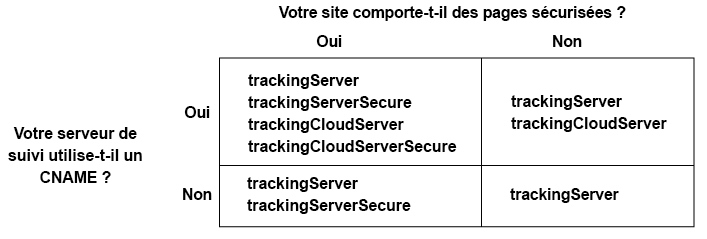

# Mise en œuvre du service Experience Cloud Identity pour Analytics, Audience Manager et Target {#implement-the-experience-cloud-id-service-for-analytics-audience-manager-and-target}

Ces instructions concernent les clients d’Analytics, d’Audience Manager et de Target qui souhaitent utiliser le service Identity d’Experience Cloud et n’utilisent pas [Balises de collecte de données](https://experienceleague.adobe.com/docs/experience-platform/tags/home.html?lang=fr). Cependant, nous vous recommandons vivement d’utiliser des balises pour mettre en oeuvre le service d’ID. Les balises simplifient le processus d’implémentation et garantissent automatiquement le placement et le séquencement corrects du code.

>[!IMPORTANT]
>
>Lisez les [exigences](../reference/requirements.md) du service d’ID avant de commencer et notez les conditions requises suivantes, qui sont spécifiques à cette mise en œuvre :
>
>* Les clients qui utilisent s_code ne peuvent pas effectuer cette procédure. Effectuez la mise à niveau vers le code mbox v61 pour terminer cette procédure.
>* Configurez ce code et testez-le dans un environnement de développement *avant* de le mettre en œuvre en production.

## Étape 1 : planifier le transfert côté serveur {#section-880797cc992d4755b29cada7b831f1fc}

En plus des étapes décrites ici, les clients qui utilisent [!DNL Analytics] et [!DNL Audience Manager] doivent passer au transfert côté serveur. Le transfert côté serveur permet de supprimer le code DIL (code de collecte de données d’Audience Manager) et de le remplacer par le [Module de Gestion de l’audience](https://experienceleague.adobe.com/docs/audience-manager/user-guide/implementation-integration-guides/integration-other-solutions/audience-management-module.html?lang=fr). Pour plus d’informations, voir la [documentation sur le transfert côté serveur](https://experienceleague.adobe.com/docs/analytics/admin/admin-tools/manage-report-suites/edit-report-suite/report-suite-general/server-side-forwarding/ssf.html?lang=fr).

La migration vers le transfert côté serveur nécessite une planification et une coordination. Ce processus implique des modifications externes du code de votre site et des étapes internes qu’Adobe doit effectuer pour approvisionner votre compte. En fait, beaucoup de ces procédures de migration doivent se produire en parallèle et être publiées ensemble. Votre chemin d’implémentation doit suivre la séquence d’événements suivante :

1. Travaillez avec vos contacts [!DNL Analytics] et [!DNL Audience Manager] pour préparer votre migration du service d’ID et du transfert côté serveur. Faites en sorte que la sélection du serveur de suivi soit un aspect essentiel de ce plan.

1. Pour démarrer, complétez le formulaire sur le [site d’intégration et de mise en service](https://adobe.allegiancetech.com/cgi-bin/qwebcorporate.dll?idx=X8SVES).

1. Mettez en œuvre le service d’ID et le [!DNL Audience Management Module] simultanément. Pour fonctionner correctement, le [!DNL Audience Management Module] (transfert côté serveur) et le service d’ID doivent être mis à jour pour le même ensemble de pages et au même moment.

## Étape 2 : télécharger le code du service d’ID {#section-0780126cf43e4ad9b6fc5fe17bb3ef86}

Le service d’ID requiert la `VisitorAPI.js` bibliothèque de code. Pour télécharger cette bibliothèque de code :

1. Accédez à **[!UICONTROL Admin > Gestionnaire de code]**.
1. Dans Gestionnaire de code, cliquez sur **[!UICONTROL JavaScript (nouveau)]** ou sur **[!UICONTROL JavaScript (hérité)]**. Les bibliothèques de code compressées sont alors téléchargées.

1. Décompressez le fichier de code, puis ouvrez le `VisitorAPI.js` fichier.

## Étape 3 : ajouter la fonction Visitor.getInstance au code du service d’ID {#section-9e30838b4d0741658a7a492153c49f27}

>[!IMPORTANT]
>
>* Les versions précédentes de l’API du service d’ID plaçaient cette fonction à un autre emplacement et nécessitaient une syntaxe différente. Si vous effectuez une migration à partir d’une version antérieure à la [version 1.4](../release-notes/notes-2015.md#section-f5c596f355b14da28f45c798df513572), notez le nouvel emplacement et la nouvelle syntaxe documentés ici.
>* Le code en MAJUSCULES est un espace réservé pour des valeurs réelles. Remplacez ce texte par votre ID d’organisation, l’URL du serveur de suivi ou toute autre valeur nommée.

**Partie 1 : Copiez la fonction Visiteur.getInstance ci-dessous**

```js
var visitor = Visitor.getInstance("INSERT-MARKETING-CLOUD-ORGANIZATION ID-HERE", { 
     trackingServer: "INSERT-TRACKING-SERVER-HERE", // same as s.trackingServer 
     trackingServerSecure: "INSERT-SECURE-TRACKING-SERVER-HERE", // same as s.trackingServerSecure 
 
     // To enable CNAME support, add the following configuration variables 
     // If you are not using CNAME, DO NOT include these variables 
     marketingCloudServer: "INSERT-TRACKING-SERVER-HERE", 
     marketingCloudServerSecure: "INSERT-SECURE-TRACKING-SERVER-HERE" // same as s.trackingServerSecure 
}); 
```

**Partie 2 : Ajoutez le code de la fonction au fichier API.js du Visiteur**

Placez la `Visitor.getInstance` fonction à la fin du fichier, après le bloc de code. Le fichier modifié doit ressembler à celui-ci :

```js
/* 
========== DO NOT ALTER ANYTHING BELOW THIS LINE ========== 
Version and copyright section 
*/ 
 
// Visitor API code library section 
 
// Put Visitor.getInstance at the end of the file, after the code library 
 
var visitor = Visitor.getInstance("INSERT-MARKETING-CLOUD-ORGANIZATION ID-HERE", { 
     trackingServer: "INSERT-TRACKING-SERVER-HERE", // same as s.trackingServer 
     trackingServerSecure: "INSERT-SECURE-TRACKING-SERVER-HERE", // same as s.trackingServerSecure 
 
     // To enable CNAME support, add the following configuration variables 
     // If you are not using CNAME, DO NOT include these variables 
     marketingCloudServer: "INSERT-TRACKING-SERVER-HERE", 
     marketingCloudServerSecure: "INSERT-SECURE-TRACKING-SERVER-HERE" // same as s.trackingServerSecure 
}); 
```

## Étape 4 : ajouter l’ID d’organisation Experience Cloud à Visitor.getInstance {#section-e2947313492546789b0c3b2fc3e897d8}

Dans la `Visitor.getInstance` fonction, remplacez `INSERT-MARKETING-CLOUD-ORGANIZATION ID-HERE` par l’ID d’organisation Experience Cloud. Si vous ne connaissez pas votre ID d’organisation, vous pouvez le trouver sur la page d’administration d’Experience Cloud. La fonction modifiée peut ressembler à l’exemple ci-après.

`var visitor = Visitor.getInstance("1234567ABC@AdobeOrg", { ...`

>[!IMPORTANT]
>
>*Ne modifiez pas* la casse des caractères de l’ID d’organisation. L’ID est sensible à la casse et doit être utilisé tel quel.

## Étape 5 : ajouter des serveurs de suivi à Visitor.getInstance {#section-0dfc52096ac2427f86045aab9a0e0dfc}

Analytics utilise des serveurs de suivi pour la collecte de données.

**Partie 1 : Recherchez les URL de serveur de suivi**

Dans le fichier `s_code.js` ou `AppMeasurement.js`, recherchez les URL de serveur de suivi. Les URL doivent être spécifiées par les variables suivantes :

* `s.trackingServer`
* `s.trackingServerSecure`

**Partie 2 : Définissez les variables de serveur de suivi**

Pour déterminer les variables de serveur de suivi à utiliser :

1. Répondez aux questions présentées dans le tableau ci-après. Utilisez les variables qui correspondent à vos réponses.
1. Remplacez les espaces réservés au serveur de suivi par les URL du serveur de suivi.
1. Supprimez du code les variables de serveur de suivi et de les variables de serveur Experience Cloud inutilisées.



>[!NOTE]
>
>Lorsqu’elles sont utilisées, faites correspondre les URL du serveur Experience Cloud aux URL du serveur de suivi de la façon suivante :

* URL du serveur Experience Cloud = URL du serveur de suivi
* URL du serveur de suivi sécurisé Experience Cloud = URL du serveur de suivi sécurisé

Si vous ne savez pas comment trouver votre serveur de suivi, consultez la [FAQ](../faq-intro/faq.md) et la [Collecte correcte des variables trackingServer et trackingServerSecure](https://helpx.adobe.com/fr/analytics/kb/determining-data-center.html#).

## Étape 6 : mettre à jour votre fichier AppMeasurement.js {#section-5517e94a09bc44dfb492ebca14b43048}

Cette procédure nécessite [!UICONTROL AppMeasurement]. Vous ne pouvez pas continuer si vous utilisez toujours s_code.

Ajoutez la `Visitor.getInstance` fonction affichée ci-dessous à votre `AppMeasurement.js` fichier. Placez-le dans la section qui contient des configurations telles que `linkInternalFilters`, `charSet`, `trackDownloads`, etc. :

`s.visitor = Visitor.getInstance("INSERT-MARKETING-CLOUD-ORGANIZATION ID-HERE");`

>[!IMPORTANT]
>
>À cette étape, vous devez supprimer le code [!DNL Audience Manager] DIL d’et le remplacer avec le Module de Gestion de l’audience. Voir [Mise en œuvre du transfert côté serveur](https://experienceleague.adobe.com/docs/analytics/admin/admin-tools/server-side-forwarding/ssf.html?lang=fr) pour obtenir des instructions.

***(Étape facultative mais recommandée)* Créez une prop personnalisée.**

Définir une prop personnalisée dans le fichier `AppMeasurement.js` pour mesurer la couverture. Ajoutez la prop personnalisée suivante à la `doPlugins` fonction de votre `AppMeasurement.js` fichier :

```js
// prop1 is used as an example only. Choose any available prop. 
s.prop1 = (typeof(Visitor) != "undefined" ? "VisitorAPI Present" : "VisitorAPI Missing");
```

## Étape 7 : ajouter le code de l’API visiteur à la page {#section-c2bd096a3e484872a72967b6468d3673}

Placez le fichier ` [!UICONTROL VisitorAPI.js]` à l’intérieur des balises `<head>` sur chaque page. Lorsque vous placez le `VisitorAPI.js` fichier sur votre page :

* Insérez-le au début de la `<head>` section afin qu’il s’affiche avant les balises d’autres solutions.
* Il doit s’exécuter avant AppMeasurement et le code d’autres [!DNL Experience Cloud] solutions.

## Étape 8 : (facultative) configurer un délai de grâce {#section-aceacdb7d5794f25ac6ff46f82e148e1}

Si l’un de ces cas d’utilisation s’applique à votre situation, demandez à [l’Assistance clientèle](https://helpx.adobe.com/fr/marketing-cloud/contact-support.html) de mettre en place une [période de grâce](../reference/analytics-reference/grace-period.md) temporaire. Les périodes de grâce peuvent durer jusqu’à 180 jours. Vous pouvez renouveler une période de grâce si nécessaire.

**Mise en œuvre partielle**

Vous avez besoin d’une période de grâce si certaines pages utilisent le service d’ID et d’autres pas et si elles signalent des informations dans la même suite de rapports Analytics. Cela est courant si vous disposez d’une suite de rapports globale qui crée des rapports entre domaines.

Arrêtez la période de grâce après le déploiement du service d’ID sur toutes les pages Web qui génèrent des rapports dans la même suite de rapports.

**Conditions requises pour le cookie s_vi**

Vous avez besoin d’une période de grâce si vous souhaitez que les nouveaux visiteurs disposent d’un cookie s_vi après la migration vers le service d’ID. Cela est courant si votre implémentation lit le cookie s_vi et le stocke dans une variable.

Arrêtez la période de grâce une fois que votre implémentation peut capturer le MID au lieu de lire le cookie s_vi.

Voir aussi [Cookies et service d’identités Experience Cloud](../introduction/cookies.md).

**Intégration des données du parcours de navigation**

Vous avez besoin d’une période de grâce si vous envoyez les données à un système interne à partir d’un flux de données de parcours de navigation et si ce processus utilise les colonnes `visid_high` et `visid_low`.

Interrompez la période de grâce une fois que le processus d’ingestion des données peut utiliser les colonnes `post_visid_high` et `post_visid_low`.

Voir aussi [Référence des colonnes de données du parcours de navigation](https://experienceleague.adobe.com/docs/analytics/export/analytics-data-feed/data-feed-overview.html?lang=fr).

## Étape 9 : tester et vérifier {#section-f857542bfc70496dbb9f318d6b3ae110}

Lors de cette mise en œuvre, les solutions [!DNL Experience Cloud] renvoient des identifiants sous la forme de paires clés-valeurs. Chaque solution utilise des clés différentes (par exemple, le [!DNL Analytics] SDID et le [!DNL Target] mboxMCSDID) pour un même identifiant. Pour tester votre mise en œuvre, chargez votre page dans un environnement de développement. Utilisez votre console ou logiciel de navigateur qui contrôle les demandes et réponses HTTP pour vérifier les identifiants répertoriés ci-dessous. Le service d’ID a été mise en œuvre correctement si les paires clés-valeurs répertoriées ci-dessous renvoient les mêmes valeurs d’identifiant.

>[!TIP]
>
>Vous pouvez utiliser le [débogueur Adobe](https://experienceleague.adobe.com/docs/analytics/implementation/validate/debugger.html?lang=fr) ou le [proxy HTTP Charles](https://www.charlesproxy.com/) pour rechercher ces identifiants spécifiques à une solution. Cependant, sentez-vous libre d’utiliser l’outil ou le débogueur qui fonctionne le mieux pour vous.

**Toutes les solutions**

Vérifiez les éléments suivants :

* [le cookie AMCV](../introduction/cookies.md) dans le domaine où est hébergée votre page ;
* l’[!DNL Experience Cloud] ID (MID) avec le débogueur [!DNL Adobe] ou votre outil de débogage préféré.

Pour des vérifications supplémentaires qui vous aident à déterminer si le service d’ID fonctionne correctement, voir [Test et vérification du service Experience Cloud Identity](../implementation-guides/test-verify.md).

**Analytics**

Recherchez l’identifiant SDID dans la demande JavaScript. L’Analytics SDID doit correspondre au mboxMCSDID Target.

Si vos tests renvoient un AID, cela indique l’un des éléments suivants :

* Vous êtes un visiteur qui revient en cours de migration des [!DNL Analytics] identifiants hérités.
* Vous avez activé une [période de grâce](../reference/analytics-reference/grace-period.md).

Si un AID s’affiche, vérifiez sa valeur par rapport au [!DNL Target] mboxMCAVID. Ces valeurs sont identiques lorsque le service d’ID a été correctement mis en œuvre.

**Audience Manager**

Pour tester le transfert côté serveur, voir [Comment vérifier l’implémentation du transfert côté serveur](https://experienceleague.adobe.com/docs/analytics/admin/admin-tools/server-side-forwarding/ssf-verify.html?lang=fr).

**Target**

Vérifiez les éléments suivants :

* mboxMCGVID
* mboxMCSDID (Le mboxMCSDID doit correspondre au SDID Analytics).

Si vos tests renvoient un mboxMCAVID, cela indique l’un des éléments suivants :

* Vous êtes un visiteur qui revient en cours de migration des [!DNL Analytics] identifiants hérités.
* Vous avez activé une période de grâce.

Si un mboxMCAVID s’affiche, vérifiez sa valeur par rapport à [!DNL Analytics] l’AID. Ces valeurs sont identiques lorsque le service d’ID a été correctement mis en œuvre.

**Déploiement**

## Étape 10 : déployer {#section-4188fa95e7dc455a986b48a6c517c1c9}

Déployez votre code une fois qu’il a réussi le test.

Si vous avez activé une période de grâce :

* Vérifiez que l’Analytics ID (AID) et le MID figurent dans la demande d’image.
* Souvenez-vous de désactiver la période de grâce lorsque les [critères d’interruption](../implementation-guides/setup-aam-analytics-target.md#section-aceacdb7d5794f25ac6ff46f82e148e1) sont remplis.
