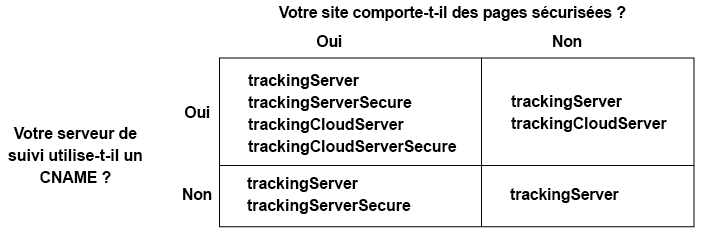

# Mise en œuvre du service d’identification des visiteurs Adobe pour Analytics et Audience Manager{#implement-the-experience-cloud-id-service-for-analytics-and-audience-manager}

Ces instructions s’adressent aux clients Analytics et Audience Manager qui souhaitent utiliser le service d’identification des visiteurs et n’utilisent pas de [balises](https://experienceleague.adobe.com/docs/experience-platform/tags/home.html?lang=fr). Cependant, nous vous recommandons vivement d’utiliser les balises pour implémenter le service d’identification des visiteurs. Les balises optimisent le workflow d’implémentation et assurent automatiquement le placement et le séquencement adéquats du code.

>[!IMPORTANT]
>
>* [Lisez les conditions requises](../reference/requirements.md) avant de commencer.
>* Cette procédure nécessite AppMeasurement. Les clients qui utilisent s_code ne peuvent pas effectuer cette procédure.
>* Configurez ce code et testez-le dans un environnement de développement avant de le mettre en œuvre en production.

## Étape 1 : planifier le transfert côté serveur {#section-880797cc992d4755b29cada7b831f1fc}

En plus des étapes décrites ici, les clients qui utilisent Analytics et Audience Manager doivent passer au transfert côté serveur. Le transfert côté serveur permet de supprimer le code DIL (code de collecte de données d’Audience Manager) et de le remplacer par le [Module de Gestion de l’audience](https://experienceleague.adobe.com/docs/audience-manager/user-guide/implementation-integration-guides/integration-other-solutions/audience-management-module.html?lang=fr). Pour plus d’informations, voir la [documentation sur le transfert côté serveur](https://experienceleague.adobe.com/docs/analytics/admin/admin-tools/manage-report-suites/edit-report-suite/report-suite-general/server-side-forwarding/ssf.html?lang=fr).

La migration vers le transfert côté serveur nécessite une planification et une coordination. Ce processus implique des modifications externes du code de votre site et des étapes internes qu’Adobe doit effectuer pour approvisionner votre compte. En fait, beaucoup de ces procédures de migration doivent se produire en parallèle et être publiées ensemble. Votre chemin d’implémentation doit suivre la séquence d’événements suivante :

1. Collaborez avec vos contacts Analytics et Audience Manager pour planifier la migration de votre service d’identification des visiteurs et du transfert côté serveur. Faites en sorte que la sélection du serveur de suivi soit un aspect essentiel de ce plan.

1. Pour démarrer, complétez le formulaire sur le [site d’intégration et de mise en service](https://adobe.allegiancetech.com/cgi-bin/qwebcorporate.dll?idx=X8SVES).

1. Mettez en œuvre simultanément le service d’identification des visiteurs et le module de gestion de l’audience. Pour fonctionner correctement, le module de gestion de l’audience (transfert côté serveur) et le service d’identification des visiteurs doivent être publiés pour le même ensemble de pages et en même temps.

## Étape 2 : télécharger le code du service d’identification des visiteurs {#section-0780126cf43e4ad9b6fc5fe17bb3ef86}

Le service d’identification des visiteurs nécessite la bibliothèque de code `VisitorAPI.js`. Pour télécharger cette bibliothèque de code :

1. Accédez à **[!UICONTROL Admin]** > **[!UICONTROL Code Manager]**.

1. Dans le Gestionnaire de code, cliquez sur **[!UICONTROL JavaScrpt (New)]** ou **[!UICONTROL JavaScript (Legacy)]**. Les bibliothèques de code compressées sont alors téléchargées.

1. Décompressez le fichier de code, puis ouvrez le `VisitorAPI.js` fichier.

## Étape 3 : ajouter la fonction Visitor.getInstance au code du service d’identification des visiteurs {#section-9e30838b4d0741658a7a492153c49f27}

>[!IMPORTANT]
>
>* Les versions précédentes de l’API du service d’identification des visiteurs plaçaient cette fonction à un emplacement différent et nécessitaient une syntaxe différente. Si vous effectuez une migration à partir d’une version antérieure à la [version 1.4](../release-notes/notes-2015.md#section-f5c596f355b14da28f45c798df513572), notez le nouvel emplacement et la nouvelle syntaxe documentés ici.
>* Le code en MAJUSCULES est un espace réservé pour des valeurs réelles. Remplacez ce texte par votre ID d’organisation IMS, l’URL du serveur de suivi ou une autre valeur nommée.

**Partie 1 : Copiez la fonction Visiteur.getInstance ci-dessous**

```js
var visitor = Visitor.getInstance("INSERT-IMS-ORG-ID-HERE", { 
     trackingServer: "INSERT-TRACKING-SERVER-HERE", // same as s.trackingServer 
     trackingServerSecure: "INSERT-SECURE-TRACKING-SERVER-HERE", // same as s.trackingServerSecure 
 
     // To enable CNAME support, add the following configuration variables 
     // If you are not using CNAME, DO NOT include these variables 
     marketingCloudServer: "INSERT-TRACKING-SERVER-HERE", 
     marketingCloudServerSecure: "INSERT-SECURE-TRACKING-SERVER-HERE" // same as s.trackingServerSecure 
}); 
```

**Partie 2 : ajoutez le code de fonction au fichier `VisitorAPI.js`**

Placez la `Visitor.getInstance` fonction à la fin du fichier, après le bloc de code. Le fichier modifié doit ressembler à celui-ci :

```js
/* 
========== DO NOT ALTER ANYTHING BELOW THIS LINE ========== 
Version and copyright section 
*/ 
 
// Visitor API code library section 
 
// Put Visitor.getInstance at the end of the file, after the code library 
 
var visitor = Visitor.getInstance("INSERT-IMS-ORG-ID-HERE", { 
     trackingServer: "INSERT-TRACKING-SERVER-HERE", // same as s.trackingServer 
     trackingServerSecure: "INSERT-SECURE-TRACKING-SERVER-HERE", // same as s.trackingServerSecure 
 
     // To enable CNAME support, add the following configuration variables 
     // If you are not using CNAME, DO NOT include these variables 
     marketingCloudServer: "INSERT-TRACKING-SERVER-HERE", 
     marketingCloudServerSecure: "INSERT-SECURE-TRACKING-SERVER-HERE" // same as s.trackingServerSecure 
}); 
```

## Étape 4 : ajouter votre ID d’organisation IMS à Visitor.getInstance {#section-e2947313492546789b0c3b2fc3e897d8}

Dans la fonction `Visitor.getInstance` , remplacez `INSERT-IMS-ORG-ID-HERE` par votre ID d’organisation IMS. Si vous ne connaissez pas votre identifiant de l’organisation IMS, vous pouvez le trouver sur la page d’administration de l’entreprise CX. La fonction modifiée peut ressembler à l’exemple ci-après.

`var visitor = Visitor.getInstance("1234567ABC@AdobeOrg", { ...`

>[!IMPORTANT]
>
>*Ne modifiez pas* la casse des caractères de votre identifiant de l’organisation IMS. L’ID est sensible à la casse et doit être utilisé tel quel.

## Étape 5 : ajouter des serveurs de suivi à Visitor.getInstance {#section-0dfc52096ac2427f86045aab9a0e0dfc}

Analytics utilise des serveurs de suivi pour la collecte de données.

**Partie 1 : Recherchez les URL de serveur de suivi**

Dans le fichier `s_code.js` ou `AppMeasurement.js`, recherchez les URL de serveur de suivi. Les URL doivent être spécifiées par les variables suivantes :

* `s.trackingServer`
* `s.trackingServerSecure`

**Partie 2 : Définissez les variables de serveur de suivi**

Pour déterminer les variables de serveur de suivi à utiliser :

1. Répondez aux questions présentées dans le tableau ci-après. Utilisez les variables qui correspondent à vos réponses.
1. Remplacez les espaces réservés au serveur de suivi par les URL du serveur de suivi.
1. Supprimez du code les variables de serveur de suivi inutilisées et de serveur CX Enterprise.



>[!NOTE]
>
>Lorsqu’elles sont utilisées, faites correspondre les URL du serveur CX Enterprise aux URL du serveur de suivi correspondantes comme suit :

* URL du serveur CX Enterprise = URL du serveur de suivi
* URL sécurisée du serveur d’entreprise CX = URL sécurisée du serveur de suivi

Si vous ne savez pas comment trouver votre serveur de suivi, consultez la [FAQ](../faq-intro/faq.md) et la [Collecte correcte des variables trackingServer et trackingServerSecure](https://helpx.adobe.com/fr/analytics/kb/determining-data-center.html#).

## Étape 6 : mettre à jour votre fichier AppMeasurement.js {#section-5517e94a09bc44dfb492ebca14b43048}

Cette étape nécessite [!UICONTROL AppMeasurement]. Vous ne pouvez pas continuer si vous utilisez toujours s_code.

Ajoutez la `Visitor.getInstance` fonction affichée ci-dessous à votre `AppMeasurement.js` fichier. Placez-le dans la section qui contient des configurations telles que `linkInternalFilters`, `charSet`, `trackDownloads`, etc. :

`s.visitor = Visitor.getInstance("INSERT-IMS-ORG-ID-HERE");`

>[!IMPORTANT]
>
>À ce stade, vous devez supprimer le code Audience Manager DIL et le remplacer par le module Gestion de l’audience . Voir [Mise en œuvre du transfert côté serveur](https://experienceleague.adobe.com/docs/analytics/admin/admin-tools/server-side-forwarding/ssf.html?lang=fr) pour obtenir des instructions.

***(Étape facultative mais recommandée)* Créez une prop personnalisée.**

Définir une prop personnalisée dans le fichier `AppMeasurement.js` pour mesurer la couverture. Ajoutez la prop personnalisée suivante à la `doPlugins` fonction de votre `AppMeasurement.js` fichier :

```js
// prop1 is used as an example only. Choose any available prop. 
s.prop1 = (typeof(Visitor) != "undefined" ? "VisitorAPI Present" : "VisitorAPI Missing");
```

## Étape 7 : ajouter le code de l’API visiteur à la page {#section-c2bd096a3e484872a72967b6468d3673}

Placez le fichier `VisitorAPI.js` à l’intérieur des balises `<head>` sur chaque page. Lorsque vous placez le `VisitorAPI.js` fichier sur votre page :

* Insérez-le au début de la `<head>` section afin qu’il s’affiche avant les balises d’autres solutions.
* Il doit s’exécuter avant AppMeasurement et le code pour les autres solutions d’entreprise CX.

## Étape 8 : (facultative) configurer un délai de grâce {#section-aceacdb7d5794f25ac6ff46f82e148e1}

Si l’un de ces cas d’utilisation s’applique à votre situation, demandez à [l’Assistance clientèle](https://helpx.adobe.com/fr/marketing-cloud/contact-support.html) de mettre en place une [période de grâce](https://experienceleague.adobe.com/en/docs/analytics/implementation/id/migration) temporaire. Les périodes de grâce peuvent durer jusqu’à 180 jours. Vous pouvez renouveler une période de grâce si nécessaire.

**Mise en œuvre partielle**

Vous avez besoin d’une période de grâce si certaines pages utilisent le service d’identification des visiteurs et d’autres pas, et qu’elles génèrent toutes des rapports dans la même suite de rapports Analytics. Cela est courant si vous disposez d’une suite de rapports globale qui crée des rapports entre domaines.

Mettez fin à la période de grâce une fois que le service d’identification des visiteurs a été déployé sur toutes vos pages web qui font rapport dans la même suite de rapports.

**Conditions requises pour le cookie s_vi**

Vous avez besoin d’une période de grâce si vous avez besoin que les nouveaux visiteurs disposent d’un cookie s_vi après la migration vers le service d’identification des visiteurs. Cela est courant si votre implémentation lit le cookie s_vi et le stocke dans une variable.

Arrêtez la période de grâce une fois que votre implémentation peut capturer le MID au lieu de lire le cookie s_vi.

Voir aussi [ Cookies et service d’identification des visiteurs ](../introduction/cookies.md).

**Intégration des données du flux de clics**

Vous avez besoin d’une période de grâce si vous envoyez les données à un système interne à partir d’un flux de données de flux de clics et si ce processus utilise les colonnes `visid_high` et `visid_low`.

Interrompez la période de grâce une fois que le processus d’ingestion des données peut utiliser les colonnes `post_visid_high` et `post_visid_low`.

Voir aussi [Référence des colonnes de données du flux de clics](https://experienceleague.adobe.com/docs/analytics/export/analytics-data-feed/data-feed-overview.html?lang=fr).

## Étape 9 : tester et déployer le code du service d’identification des visiteurs {#section-f857542bfc70496dbb9f318d6b3ae110}

Vous pouvez tester et déployer les éléments comme suit.

**Tests et vérification**

Pour tester l’implémentation du service d’identification des visiteurs, recherchez les éléments suivants :

* [le cookie AMCV](../introduction/cookies.md) dans le domaine où est hébergée votre page.
* Valeur du MID dans la demande d’image Analytics avec le [débogueur Adobe](https://experienceleague.adobe.com/docs/analytics/implementation/validate/debugger.html?lang=fr).
* Voir aussi [Test et vérification du service d’identification des visiteurs](../implementation-guides/test-verify.md).

Pour vérifier le transfert côté serveur, voir [Comment vérifier l’implémentation du transfert côté serveur](https://experienceleague.adobe.com/docs/analytics/admin/admin-tools/server-side-forwarding/ssf-verify.html?lang=fr).

**Déploiement**

Déployez votre code une fois qu’il a réussi le test.

Si vous avez activé une période de grâce :

* Vérifiez que l’Analytics ID (AID) et le MID figurent dans la demande d’image.
* Souvenez-vous de désactiver la période de grâce lorsque les critères d’interruption sont remplis.

