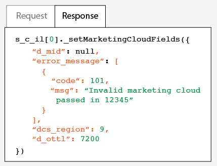

# Mise en œuvre avec Dynamic Tag Management {#implementation-with-dynamic-tag-management}

Les mises en œuvre précédentes utilisaient Dynamic Tag Management (DTM) pour configurer, déployer et intégrer le service Experience Cloud Identity à vos autres solutions Experience Cloud.

## Mise en œuvre avec Dynamic Tag Management {#topic-6f4ed5d96977406ca991e50f3fbd5b01}

Les mises en œuvre précédentes utilisaient Dynamic Tag Management (DTM) pour configurer, déployer et intégrer le service Experience Cloud Identity à vos autres solutions Experience Cloud.

>[!NOTE]
>
>Currently, [Adobe Experience Platform Launch](https://docs.adobelaunch.com/) is the preferred and recommended implementation tool because it helps simplify complex tag management tasks and automates code placement beyond the capabilities of DTM. Voir [Mise en œuvre avec Launch](../implementation-guides/ecid-implement-with-launch.md).

## Dynamic Tag Management et service d’ID {#section-4a4c4fac5d0a4cbbaff8e1833f73657c}

[La gestion](https://marketing.adobe.com/resources/help/en_US/dtm/) dynamique des balises vous permet de configurer, de déployer et de gérer votre instance de service d’ID et les intégrations de [!DNL Experience Cloud] solutions associées. DTM aide à simplifier le processus de mise en œuvre parce qu’il est profondément intégré au service d’ID et aux autres solutions Experience Cloud. Ajoutez simplement l’outil Experience Cloud ID et configurez-le, puis définissez des informations, telles que :

* ID d’organisation d’Experience Cloud (automatiquement renseigné s’il est lié à Experience Cloud)
* Serveur de suivi Analytics (sécurisé et non sécurisé)
* Serveur Experience Cloud (pour les serveurs de suivi propriétaires)

DTM est mise gratuitement à disposition de tous les [!DNL Experience Cloud] clients.

**Prise en main de DTM**

DTM est un outil simple, mais puissant. Si vous ne l’utilisez pas déjà, nous vous recommandons vivement de le faire. Voir la [documentation](https://marketing.adobe.com/resources/help/en_US/dtm/c_overview.html) DTM et la [vidéo de prise en main de DTM](https://marketing.adobe.com/resources/help/en_US/dtm/jump-start-videos.html) pour démarrer avec ce service. Pour obtenir des instructions relatives à la configuration du service d’ID avec DTM, voir les informations et procédures des sections ci-dessous.

## Consignes de déploiement {#concept-54a2ec49af8f4bfca9207b1d404e8e1a}

Consultez les conditions requises et les procédures suivantes avant d’essayer de mettre en œuvre le service Experience Cloud Identity avec Dynamic Tag Management (DTM).

<!--
mcvid-dtm-deployment.xml
-->

**Configuration de votre compte**

Avant de commencer, assurez-vous d’avoir configuré votre organisation et vos solutions pour [!DNL Experience Cloud]. Vous devez également vous familiariser avec [!DNL Dyanamic Tag Management]. Cette documentation peut vous aider à démarrer :

* [Activez vos solutions pour les services](https://marketing.adobe.com/resources/help/en_US/mcloud/core_services.html)principaux : Mettez en oeuvre Experience Cloud et devenez administrateur. Ce processus modernise vos solutions en ce qui concerne les services principaux tels que les attributs du client et les audiences Experience Cloud.
* [Prise en main de Dynamic Tag Management](https://marketing.adobe.com/resources/help/en_US/dtm/get_started.html)
* [Vidéos](https://marketing.adobe.com/resources/help/en_US/dtm/jump-start-videos.html)de démarrage rapide : Une série de courtes vidéos qui montrent comment effectuer des tâches de gestion dynamique des balises de base.

**Emplacement et ordre de chargement du code du service d’ID**

Le service d’ID fonctionne en demandant et en recevant un identifiant unique à partir des serveurs de collecte des données [!DNL Adobe]. Pour fonctionner correctement, le code du service d’ID doit être :

* Le premier bloc de [!DNL Adobe] code qui s’exécute sur la page.
* Situé le plus haut possible sur la page, généralement à l’intérieur du `<head>` bloc de code.

Tant que vous conservez toutes vos solutions et bibliothèques de code [!DNL Adobe] dans DTM, il fera en sorte que le code de votre service d’ID soit situé au bon endroit et qu’il s’exécute au bon moment.

**Validation de la collecte de données régionale**

Customers must provide a CNAME or use `*.sc.omtrdc` for [regional data collection](https://marketing.adobe.com/resources/help/en_US/whitepapers/rdc/) (RDC). Demandez à votre consultant [!DNL Adobe] de vous fournir les paramètres RDC spécifiques.

**Configuration des suites de rapports Analytics**

Les nouveaux clients [!DNL Analytics] doivent [créer une suite de rapports](https://marketing.adobe.com/resources/help/en_US/reference/new_report_suite.html) pour la collecte des données.

## Mise en œuvre du service Experience Cloud Identity à l’aide de DTM {#task-a659cf19dea84ad48edabe0b72ef9f5c}

Suivez les étapes suivantes pour mettre en œuvre le service d’ID avec Dynamic Tag Management (DTM).

**Conditions préalables**

* Activez vos solutions pour [!DNL Experience Cloud] et vérifiez que vous disposez des autorisations de niveau administrateur. See [Enable your solutions for core services](https://marketing.adobe.com/resources/help/en_US/mcloud/core_services.html).

* Création d’une propriété Web dans DTM. Voir la documentation DTM [Création d’une propriété Web](https://marketing.adobe.com/resources/help/en_US/dtm/web_property.html) ou la [vidéo de prise en main rapide pour les administrateurs](https://marketing.adobe.com/resources/help/en_US/dtm/admin-jump-start.html).

<!--
mcvid-dtm-implement.xml
-->

**Étapes de mise en œuvre** Pour mettre en œuvre le service d’ID avec DTM, procédez comme suit :

1. Dans le [!UICONTROL tableau de bord] DTM, cliquez sur la propriété Web avec laquelle vous souhaitez travailler.
1. Dans l’onglet **[!UICONTROL Aperçu]** de la propriété Web sélectionnée, cliquez sur **[!UICONTROL Ajouter un outil]**.
1. Dans la liste **[!UICONTROL Type d’outil]**, cliquez sur **[!UICONTROL Service Experience Cloud Identity]**.

   >[!NOTE]
   >
   >Cette action renseigne le champ **[!UICONTROL ID d’organisation d’Experience Cloud]** avec votre ID d’organisation. Si votre compte DTM n’est pas associé à [!DNL Experience Cloud], vous devrez fournir cet ID. Pour associer votre compte, voir [Association des comptes dans Experience Cloud](https://marketing.adobe.com/resources/help/en_US/mcloud/organizations.html). Voir les [conditions requises](../reference/requirements.md#section-a02f537129a64ffbb690d5738d360c26) pour obtenir des informations sur la manière de trouver votre ID d’organisation.

1. Saisissez le nom de votre serveur de suivi dans la boîte **[!UICONTROL Serveur de suivi]**. If you're not sure how to find your tracking server see the [FAQ](../faq-intro/faq.md) and [Correctly Populate the trackingServer and trackingServerSecure variables](https://helpx.adobe.com/analytics/kb/determining-data-center.html#).
1. Cliquez sur **[!UICONTROL Créer un outil]**, puis sur **[!UICONTROL Enregistrer les modifications]**.

   Après l’enregistrement, le service d’ID est configuré en tant qu’outil dans DTM. Cependant, il n’est pas encore prêt à l’emploi. Votre outil DTM doit encore passer le processus de publication/d’approbation de DTM, et vous avez l’occasion de configurer des paramètres supplémentaires. Pour plus d’informations sur le processus d’approbation de DTM, voir la vidéo [Prise en main rapide des fondamentaux pour les utilisateurs](https://marketing.adobe.com/resources/help/en_US/dtm/user-basics-jump-start.html). Pour plus d’informations sur les paramètres supplémentaires que vous pouvez ajouter à DTM, voir [Paramètres du service Experience Cloud Identity pour DTM](../implementation-guides/standard.md#concept-fb6cb6a0e6cc4f10b92371f8671f6b59).

>[!MORE_LIKE_THIS]
>
>* [Propriétés Web](https://marketing.adobe.com/resources/help/en_US/dtm/web_property.html)


## Paramètres du service Experience Cloud Identity pour DTM {#concept-fb6cb6a0e6cc4f10b92371f8671f6b59}

Décrit les champs [!UICONTROL ID d’organisation], [!UICONTROL Général] et [!UICONTROL Paramètres client] et la manière dont ils sont utilisés par le service [!DNL Experience Cloud] ID.

<!--
mcvid-dtm-settings.xml
-->

## Comment puis-je trouver ces paramètres ?{#section-c5b2d1c928944ae2b8565c1b182fe575}

Les paramètres sont disponibles une fois que vous avez ajouté et enregistré le service d’ID en tant qu’outil dans Dynamic Tag Management (DTM). Vous pouvez également accéder à ces paramètres en cliquant sur l’icône représentant une roue dentée à partir de la section [!UICONTROL Outils installés] de votre propriété Web DTM.


## ID d’organisation {#section-949b5a0d8af940558b04ff675cf53f77}

ID requis et associé à votre société [!DNL Experience Cloud] configurée. Une organisation est l’entité qui permet à un administrateur de configurer des groupes et des utilisateurs et de contrôler l’accès par authentification unique à [!DNL Experience Cloud]. L’ID d’organisation correspond à une chaîne de 24 caractères alphanumériques, suivie de @AdobeOrg (obligatoire). Les administrateurs [!DNL Experience Cloud] peuvent accéder à cet ID dans [Experience Cloud &gt; Outils](https://marketing.adobe.com/resources/help/en_US/mcloud/admin_getting_started.html).


Voir également [Cookies et service Experience Cloud Identity](../introduction/cookies.md).

## Paramètres généraux {#section-071d358e40f84629a8901b893dd61392}

Ces paramètres vous permettent de définir les serveurs de suivi et les versions de code, et d’ajouter d’autres variables.


Le tableau suivant répertorie et définit les paramètres [!UICONTROL généraux].

**Demander automatiquement l’identifiant du visiteur**

Lorsque cette case est activée, Dynamic Tag Management appelle automatiquement la méthode `getMarketingCloudVisitorID()` avant de charger les solutions Adobe qui utilisent le service Experience Cloud Identity.

Voir [getMarketingCloudVisitorID](../library/get-set/getmcvid.md).

**Serveur de suivi Analytics**

Le nom du serveur de suivi utilisé pour la collecte des données Analytics. Il s’agit du domaine sur lequel la demande d’image et le cookie sont écrits (par exemple, `http://site.omtrdc.net`).

Si vous ne connaissez pas les URL de votre serveur de suivi, consultez vos fichiers `s_code.js` ou `AppMeasurement.js`. L’URL est définie par la `s.trackingServer` variable.

Voir [trackingServer](https://marketing.adobe.com/resources/help/en_US/sc/implement/trackingServer.html) et [Générer correctement les variables trackingServer et trackingServerSecure](https://helpx.adobe.com/analytics/kb/determining-data-center.html#).

**Serveur de suivi sécurisé**

Le nom du serveur de suivi sécurisé utilisé pour la collecte des données Analytics. Il s’agit du domaine sur lequel la demande d’image et le cookie sont écrits (par exemple, `https://site.omtrdc.net`).

Si vous ne connaissez pas les URL de votre serveur de suivi, consultez vos fichiers `s_code.js` ou `AppMeasurement.js`. L’URL est définie par la `s.trackingServerSecure` variable.

Voir [trackingServer](https://marketing.adobe.com/resources/help/en_US/sc/implement/trackingServer.html) et [Générer correctement les variables trackingServer et trackingServerSecure](https://helpx.adobe.com/analytics/kb/determining-data-center.html#).

**Serveur Experience Cloud**

Si votre entreprise utilise la collecte de données propriétaires (CNAME) pour utiliser des cookies propriétaires dans un contexte tiers, entrez le serveur de suivi dans ce champ (par exemple, `http://metrics.company.com`).

**Serveur sécurisé Experience Cloud**

Si votre entreprise utilise la collecte de données propriétaires (CNAME) pour utiliser des cookies propriétaires dans un contexte tiers, entrez le serveur de suivi dans ce champ (par exemple, `https://metrics.company.com`).

**Version de la bibliothèque**

Définit la version de la bibliothèque de code du service d’ID (`VisitorAPI.js`) que vous devez utiliser. Vous ne pouvez pas modifier ces options du menu.

**Paramètres**

Ces champs vous permettent d’ajouter [des variables de fonction](../library/function-vars/function-vars.md) en tant que paires clé-valeur. Cliquez sur **[!UICONTROL Ajouter]** pour ajouter une ou plusieurs variables à la mise en œuvre de votre service d’ID.


>[!IMPORTANT]
>
>Définissez la `cookieDomain` variable ici. Cette variable est requise pour les domaines de niveau supérieur à parties multiples où les deux dernières parties de l’URL comporte plus de deux caractères. Voir le lien vers la documentation sur les variables de configuration ci-dessus.

## Paramètres clients {#section-238d1272c1504d148fe38fb0ae5d71c2}

Champs supplémentaires vous permettant d’ajouter un code d’intégration ou un état d’authentification.


**Code d’intégration**

Un code d’intégration est un identifiant unique fourni au client. Le code d’intégration doit contenir la valeur que vous avez utilisée pour [créer une source de données](https://marketing.adobe.com/resources/help/en_US/aam/create-datasource.html) dans [!DNL Audience Manager].

**Valeur**

La valeur doit être un élément de données contenant l’identifiant de l’utilisateur. Les éléments de données sont des composants adaptés aux valeurs dynamiques, tels que les identifiants du système interne d’un client spécifique.

**État d’authentification**

Options qui définissent ou identifient les visiteurs en fonction de leur état d’authentification (par exemple, connecté, déconnecté). Voir [ID de client et états d’authentification](../reference/authenticated-state.md)

## Test et vérification du service Experience Cloud Identity {#concept-644fdbef433b46ba9c0634ac95eaa680}

Les instructions, outils et procédures suivants vous aident à déterminer si le service d’ID fonctionne correctement. Les tests s’appliquent au service d’ID en général et pour différentes combinaisons de service d’ID et de solutions [!DNL Experience Cloud].

<!--
mcvid-test-verify.xml
-->

## Avant de commencer {#section-b1e76ad552ed4eb793b6e521a55127d4}

Informations importantes à connaître avant de commencer à tester et à vérifier le service d’ID.

**Environnements du navigateur**

Lorsque vous testez dans une session normale du navigateur, effacez le cache du navigateur avant chaque test.

Vous pouvez également tester le service d’ID dans une session anonyme ou privée du navigateur. Dans une session anonyme, vous n’avez pas besoin d’effacer les cookies ou le cache du navigateur avant chaque test.

**Outils**

Le [débogueur Adobe](https://marketing.adobe.com/resources/help/en_US/sc/implement/debugger.html) et le [proxy HTTP Charles](https://www.charlesproxy.com/) peuvent vous aider à déterminer si le service d’ID a été configuré pour fonctionner correctement avec Analytics. Les informations de cette section se basent sur les résultats renvoyés par le débogueur Adobe et Charles. Cependant, sentez-vous libre d’utiliser l’outil ou le débogueur qui fonctionne le mieux pour vous.

## Test à l’aide du débogueur Adobe {#section-861365abc24b498e925b3837ea81d469}

La mise en œuvre de votre service est correctement configurée lorsqu’un [!DNL Experience Cloud ID] (MID) s’affiche dans la réponse du [!DNL Adobe] débogueur . Voir [Cookies et service Experience Cloud Identity](../introduction/cookies.md) pour plus d’informations sur le MID.

To verify the status of the ID service with the [!DNL Adobe] [debugger](https://marketing.adobe.com/resources/help/en_US/sc/implement/debugger.html):

1. Effacez les cookies du navigateur ou ouvrez une session de navigation anonyme.
1. Chargez votre page de test qui contient le code du service d’ID.
1. Ouvrez le [!DNL Adobe] débogueur .
1. Vérifiez les résultats d’un MID.

## Comprendre les résultats du débogueur Adobe {#section-bd2caa6643d54d41a476d747b41e7e25}

Le MID est stocké dans une paire clé-valeur qui suit cette syntaxe : `MID= *`Experience Cloud ID`*`. Le débogueur affiche ces informations telles que montrées ci-dessous.

**Succès**

Le service d’ID a été correctement mis en œuvre si une réponse telle que celle-ci s’affiche :

```
mid=20265673158980419722735089753036633573
```

Si vous êtes client [!DNL Analytics], un [!DNL Analytics] ID (AID) peut s’afficher en plus du MID. Il se produit la chose suivante :

* Avec certains de vos visiteurs anciens/de longue date.
* Si une période de grâce est activée.

**Échec**

Contactez [le service à la clientèle](https://helpx.adobe.com/marketing-cloud/contact-support.html) si le débogueur :

* Ne renvoie pas un MID.
* Renvoie un message d’erreur qui indique que votre identifiant de partenaire n’a pas été attribué.

## Test à l’aide du proxy HTTP Charles {#section-d9e91f24984146b2b527fe059d7c9355}

Pour vérifier l’état du service d’ID avec Charles :

1. Effacez les cookies du navigateur ou ouvrez une session de navigation anonyme.
1. Démarrez Charles.
1. Chargez votre page de test qui contient le code du service d’ID.
1. Vérifiez les appels de demande et de réponse et les données décrites ci-dessous.

## Comprendre les résultats Charles {#section-c10c3dc0bb9945cbaffcf6fec7082fab}

Consultez cette section pour savoir où chercher et que chercher lorsque vous utilisez Charles pour surveiller les appels HTTP.

### Demandes de service d’ID réussies dans Charles

Le code de votre service d’ID fonctionne correctement si la fonction `Visitor.getInstance` lance un appel JavaScript à `dpm.demdex.net`. Une demande réussie inclut votre [ID d’organisation](../reference/requirements.md#section-a02f537129a64ffbb690d5738d360c26). L’ID d’organisation est transmis en tant que paire clé-valeur utilisant la syntaxe : `d_orgid= *`organization ID`*`. Recherchez les appels `dpm.demdex.net` et JavaScript dans l’onglet [!UICONTROL Structure]. Recherchez votre ID d’organisation dans l’onglet [!UICONTROL Demande].


### Réponses du service d’ID réussies dans Charles

Votre compte a été configuré correctement pour le service d’ID si la réponse des [serveurs de collecte des données](https://marketing.adobe.com/resources/help/en_US/aam/c_compcollect.html) (DCS) renvoie un MID. Le MID est renvoyé en tant que paire clé-valeur utilisant la syntaxe : `d_mid: visitor Experience Cloud ID`. Recherchez le MID dans l’onglet [!UICONTROL Réponse] tel qu’affiché ci-dessous.


### Échec des réponses du service d’ID dans Charles

Votre compte n’a pas été configuré correctement si la réponse DCS ne contient pas le MID. Une réponse manquée renvoie un code et un message d’erreur dans l’onglet [!UICONTROL Réponse] tel qu’affiché ci-dessous. Contactez le service à la clientèle si ce message d’erreur s’affiche dans la réponse DCS.



Pour plus d’informations sur les codes d’erreur, voir [Codes, message et exemples d’erreur DCS](https://marketing.adobe.com/resources/help/en_US/aam/dcs_error_codes.html).
