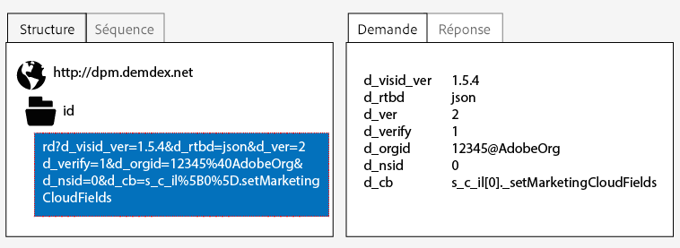
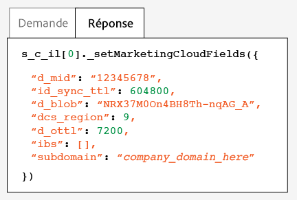
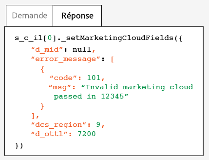

# Test et vérification du service d’identification des visiteurs Adobe{#test-and-verify-the-experience-cloud-id-service}

Ces instructions, outils et procédures vous aident à déterminer si le service d’identification des visiteurs fonctionne correctement. Ces tests s’appliquent au service d’identification des visiteurs en général et pour différentes combinaisons de service d’identification des visiteurs et de solution d’entreprise CX.

## Avant de commencer {#section-b1e76ad552ed4eb793b6e521a55127d4}

Informations importantes à connaître avant de commencer à tester et à vérifier le service d’identification des visiteurs.

**Environnements du navigateur**

Lors d’un test dans une session normale du navigateur, effacez le cache du navigateur avant chaque test.

Vous pouvez également tester le service d’identification des visiteurs dans une session de navigateur anonyme ou incognito. Dans une session anonyme, il n’est pas nécessaire d’effacer les cookies ou le cache de votre navigateur avant chaque test.

**Outils**

Le débogueur Adobe [&#128279;](https://experienceleague.adobe.com/docs/analytics/implementation/validate/debugger.html?lang=fr) et le proxy HTTP [Charles](https://www.charlesproxy.com/) peuvent vous aider à déterminer si le service d’identification des visiteurs a été configuré pour fonctionner correctement avec Analytics. Les informations de cette section sont basées sur les résultats renvoyés par le débogueur Adobe et Charles. Cependant, sentez-vous libre d’utiliser l’outil ou le débogueur qui fonctionne le mieux pour vous.

## Test à l’aide du débogueur Adobe {#section-861365abc24b498e925b3837ea81d469}

Votre intégration de service est correctement configurée lorsque vous voyez un ECID dans la réponse du débogueur Adobe. Voir [&#x200B; Cookies et service d’identification des visiteurs &#x200B;](../introduction/cookies.md) pour plus d’informations sur le MID.

Pour vérifier le statut du service d’identification des visiteurs avec Adobe [debugger](https://experienceleague.adobe.com/docs/analytics/implementation/validate/debugger.html?lang=fr) :

1. Effacez vos cookies de navigateur ou ouvrez une session de navigation anonyme.
1. Chargez votre page de test contenant le code du service d’identification des visiteurs.
1. Ouvrez le débogueur Adobe.
1. Vérifiez les résultats d’un MID.

## Comprendre les résultats du débogueur Adobe {#section-bd2caa6643d54d41a476d747b41e7e25}

Le MID est stocké dans une paire clé-valeur qui utilise cette syntaxe : `MID= *`ECID`*`. Le débogueur affiche ces informations telles que montrées ci-dessous.

**Succès**

Le service d’identification des visiteurs a été correctement mis en œuvre si vous voyez une réponse qui ressemble à ceci :

```
mid=20265673158980419722735089753036633573
```

Si vous êtes un client Analytics, vous pouvez voir un Analytics ID (AID) en plus du MID. Ceci se produit :

* Avec certains des premiers visiteurs/visiteurs de longue date sur le site.
* Si vous avez activé une période de grâce.

**Échec**

Contactez l’[Assistance clientèle](https://helpx.adobe.com/fr/marketing-cloud/contact-support.html) si le débogueur :

* Ne renvoie pas de MID.
* Renvoie un message d’erreur indiquant que votre identifiant de partenaire n’a pas été approvisionné.

## Test à l’aide du proxy HTTP Charles {#section-d9e91f24984146b2b527fe059d7c9355}

Pour vérifier le statut du service d’identification des visiteurs avec Charles :

1. Effacez vos cookies de navigateur ou ouvrez une session de navigation anonyme.
1. Démarrez Charles.
1. Chargez votre page de test contenant le code du service d’identification des visiteurs.
1. Recherchez les appels de demande et de réponse et les données décrites ci-dessous.

## Comprendre les résultats Charles {#section-c10c3dc0bb9945cbaffcf6fec7082fab}

Consultez cette section pour savoir où chercher et que chercher lorsque vous utilisez Charles pour surveiller les appels HTTP.

**Demandes réussies du service d’identification des visiteurs dans Charles**

Votre code du service d’identification des visiteurs fonctionne correctement lorsque la fonction `Visitor.getInstance` effectue un appel JavaScript à `dpm.demdex.net`. Une requête réussie inclut votre [ID d’organisation IMS](../reference/requirements.md#section-a02f537129a64ffbb690d5738d360c26). L’ID d’organisation IMS est transmis sous la forme d’une paire clé-valeur qui utilise la syntaxe suivante : `d_orgid= *`ID d’organisation IMS`*`. Recherchez les appels `dpm.demdex.net` et JavaScript dans l’onglet [!UICONTROL Structure]. Recherchez votre ID d’organisation IMS sous l’onglet [!UICONTROL Request] .



**Réponses réussies du service d’identification des visiteurs dans Charles**

Votre compte a été correctement configuré pour le service d’identification des visiteurs lorsque la réponse des [serveurs de collecte de données](https://experienceleague.adobe.com/docs/audience-manager/user-guide/reference/system-components/components-data-collection.html?lang=fr) (DCS) renvoie un MID. Le MID est renvoyé sous la forme d’une paire clé-valeur qui utilise la syntaxe suivante : `d_mid: *`visitor ECID`*`. Recherchez le MID dans l’onglet [!UICONTROL Response] tel qu’affiché ci-dessous.



**Échec des réponses du service d’identification des visiteurs dans Charles**

Votre compte n’a pas été configuré correctement si la réponse DCS ne contient pas le MID. Une réponse manquée renvoie un code et un message d’erreur dans l’onglet [!UICONTROL Response] tel qu’affiché ci-dessous. Contactez le service à la clientèle si ce message d’erreur s’affiche dans la réponse DCS.



Pour plus d’informations sur les codes d’erreur, voir [Exemples, messages et codes d’erreur DCS (DCS Error Codes, Messages, and Examples)](https://experienceleague.adobe.com/docs/audience-manager/user-guide/api-and-sdk-code/dcs/dcs-api-reference/dcs-error-codes.html?lang=fr).

