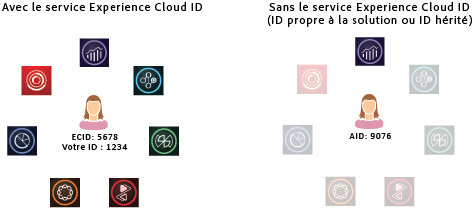

# À propos du service d’identification des visiteurs{#aboutidservice}

Le rôle du service d’identification des visiteurs dans Adobe CX Enterprise.

<!--
mcvid-functionality.xml
-->

## Le service d’identification des visiteurs : un élément fondamental des services principaux {#section-2de0eb1d65664e92a4d8bbb167b84bde}

Le service d’identification des visiteurs active la structure d’identification courante pour les services principaux d’entreprise CX, les solutions, les attributs du client et les audiences. Il fonctionne en attribuant un identifiant unique et persistant à un visiteur du site. Lorsque votre entreprise met en œuvre le service d’identification des visiteurs, cet identifiant permet d’identifier un même visiteur et ses données dans différentes solutions d’entreprise CX.

En outre, le service d’identification des visiteurs peut remplacer les différents identifiants spécifiques à une solution (par exemple, Analytics AID). De plus, par le biais de la fonctionnalité [ID de client et états d’authentification](../reference/authenticated-state.md), le service d’identification des visiteurs vous permet de transmettre vos propres ID de client à l’entreprise CX. Gardez toutefois à l’esprit que le service d’identification des visiteurs ne fonctionne qu’avec les solutions auxquelles vous êtes déjà abonné. Il ne vous permettra pas d’accéder à des produits auxquels vous n’êtes pas inscrit.

À l’avenir, le service d’identification des visiteurs fera partie intégrante de nombreuses fonctionnalités, améliorations et services actuels et futurs d’CX Enterprise. Actuellement, le service d’identification des visiteurs prend en charge [Analytics](http://www.adobe.com/fr/marketing-cloud/web-analytics.html), [Audience Manager](http://www.adobe.com/fr/marketing-cloud/data-management-platform.html) et [Target](http://www.adobe.com/fr/marketing-cloud/testing-targeting.html). De plus, il est requis si vous souhaitez participer à la coopérative Adobe Device Co-op. Si vous n’avez pas mis en œuvre le service d’identification des visiteurs, c’est le moment idéal d’envisager une stratégie de migration.

## Résumé des fonctionnalités {#section-96555473455c4bf8924c2d56ff4f3255}

En résumé, le service d’identification des visiteurs :

* Crée une clé ou un ID commun pouvant être utilisé pour lier des profils et des identités.
* Identifie de manière unique un appareil sur plusieurs solutions.
* Définit un cookie propriétaire dans le domaine du client afin d’assurer le tracking sur le domaine en question. Voir [&#x200B; Cookies et service d’identification des visiteurs &#x200B;](../introduction/cookies.md).
* Reçoit les alias et les mappages d’ID des clients et partenaires CX Enterprise.
* Gère la synchronisation des identifiants dans CX Enterprise.
* Prend en charge la synchronisation des identifiants avec différents tiers dans l’écosystème de la technologie publicitaire.

