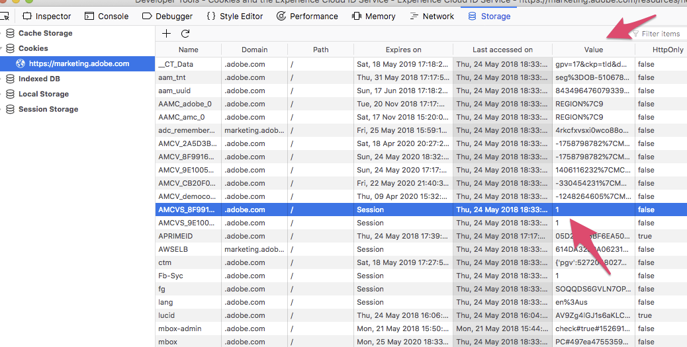

# Cookies et service d’identification des visiteurs Adobe{#cookies-and-the-experience-cloud-id-service}

Le service d’identification des visiteurs utilise votre identifiant d’organisation IMS, le cookie AMCV d’entreprise CX et un cookie demdex pour créer et stocker les identifiants uniques et persistants des visiteurs de votre site. Ces cookies permettent au service d’identification des visiteurs de suivre les visiteurs dans vos différents domaines et d’activer le partage de données entre différentes solutions d’entreprise CX.

## Présentation des cookies du service d’identification des visiteurs {#section-f438168beaec409ab8b2cc58bd021e26}

Le service d’identification des visiteurs s’appuie sur les cookies AMCV, AMCVS et demdex pour fonctionner correctement. Ces cookies sont uniquement des fichiers qui stockent les données utilisées par le service d’identification des visiteurs. Ces cookies du service d’identification des visiteurs ne sont pas dangereux, malveillants ou différents des autres cookies propriétaires ou tiers stockés par un site web ou un service dans un navigateur, en suivant les mêmes règles que celles qui régissent les autres cookies propriétaires et tiers. Pour plus d’informations sur les cookies utilisés par le service d’identification des visiteurs, consultez les sections suivantes.

### Ce que les cookies du service d’identification des visiteurs peuvent faire

* Définir et enregistrer un ID unique pour les visiteurs de votre site (le MID).
* Conservez cet identifiant unique afin que le service d’identification des visiteurs puisse collecter et partager des données avec d’autres solutions d’entreprise CX.
* Effectuez le suivi des utilisateurs sur l’ensemble de vos domaines. Toutefois, cela nécessite que vous soyez propriétaire de ces autres domaines et que du code du service d’identification des visiteurs soit déployé sur ceux-ci.

### Ce que les cookies du service d’identification des visiteurs ne peuvent pas faire

* Stocker, transmettre ou exécuter des virus informatiques.
* Accéder ou stocker des informations d’identification personnelle comme votre adresse e-mail.
* Contrôler le matériel informatique ou les logiciels.
* Rendre les ordinateurs instables ou causer des problèmes de performance.
* Effectuez le suivi des utilisateurs sur les sites qui n’utilisent pas le service d’identification des visiteurs.

## Cookie AMCV {#section-c55af54828dc4cce89f6118655d694c8}

Les attributs suivants du cookie défini par le service d’identification des visiteurs.

**Nom**

Le nom du cookie AMCV suit la syntaxe `AMCV_<variable name>@AdobeOrg`. Dans le nom, les éléments `<variable name>` sont des espaces réservés pour une partie de votre ID d’organisation IMS. Cet identifiant est transmis au serveur de collecte de données par la fonction `Visitor.getInstance` dans le code du service d’identification des visiteurs.

Un nom de cookie entièrement formé doit ressembler à celui-ci :

```
AMCV_1FD6776A524453CC0A490D44%40AdobeOrg
```

**Contenu**

Le cookie AMCV contient l’ECID ou le MID. Le MID est stocké dans une paire clé-valeur qui suit la syntaxe suivante, `MCMID|<ECID>`.

Une paire clé-valeur entièrement formée doit être identique à celle-ci :

```
MCMID|20265673158980419722735089753036633573
```

Cet identifiant persistant permet le partage de données entre solutions.

**Domaine**

Le cookie AMCV est défini sur le domaine propriétaire d’un navigateur. Cela signifie qu’il est défini dans le domaine du site actuellement visité par un utilisateur. Ainsi, le code du service d’identification des visiteurs et d’autres bibliothèques de code CX Enterprise peuvent lire le MID stocké dans le cookie AMCV.

Cependant, comme le cookie AMCV est défini dans le domaine propriétaire, il ne peut pas être utilisé pour effectuer le suivi et identifier des utilisateurs sur différents domaines. Au lieu de cela, le service d’identification des visiteurs s’appuie sur l’identifiant d’organisation IMS et l’identifiant demdex pour renvoyer le MID correct lorsqu’un visiteur du site accède à un autre domaine.

## Cookie AMCVS {#section-92a9454f1ac645948f9059b9fad928bf}

**Nom**

Le nom du cookie AMCVS suit la syntaxe `AMCVS_####@AdobeOrg`. Dans le nom, les éléments #### sont des espaces réservés pour une partie de votre ID d’organisation IMS. Cet identifiant est transmis au serveur de collecte de données par `theVisitor.getInstance` fonction dans le code du service d’identification des visiteurs.

Un nom de cookie entièrement formé doit ressembler à celui-ci :

```
AMCVS_1FD6776A524453CC0A490D44%40AdobeOrg
```

**Contenu**

Le cookie AMCVS sert de drapeau indiquant que la session a été initialisée. Sa valeur est toujours `1` et s’interrompt une fois la session terminée.

**Domaine**

Le cookie AMCVS est défini sur le domaine propriétaire d’un navigateur. Cela signifie qu’il est défini dans le domaine du site actuellement visité par un utilisateur.



## Cookie demdex {#section-7ff7d96d6e4141b08a84a75a63d7814c}

Le tableau suivant liste et définit certains attributs importants du cookie demdex.

<table id="table_18E3CAF3550E4BB6A199736AACE39202"> 
 <thead> 
  <tr> 
   <th colname="col1" class="entry"> Attribut </th> 
   <th colname="col2" class="entry"> Description </th> 
  </tr> 
 </thead>
 <tbody> 
  <tr> 
   <td colname="col1"> <p> <b>Nom</b> </p> </td> 
   <td colname="col2"> <p>Le nom du cookie est « demdex ». </p> </td> 
  </tr> 
  <tr> 
   <td colname="col1"> <p> <b>Contenu</b> </p> </td> 
   <td colname="col2"> <p>Le cookie demdex contient l’ID demdex, qui est généré par le serveur de collecte de données. </p> </td> 
  </tr> 
  <tr> 
   <td colname="col1"> <p> <b>Domaine</b> </p> </td> 
   <td colname="col2"> <p>Le cookie demdex est défini sur le domaine demdex.net tiers dans le navigateur. Ce domaine est distinct du site actuellement visité par un utilisateur. </p> <p>Contrairement au cookie AMCV propriétaire, le cookie et l’ID demdex persistent dans les différents domaines. L’identifiant demdex et votre identifiant d’organisation IMS sont les valeurs communes qui permettent au service d’identification des visiteurs de revenir et d’identifier un visiteur du site avec l’identifiant visiteur approprié. </p> </td> 
  </tr> 
 </tbody> 
</table>

Pour plus d’informations sur les divulgations concernant Demdex, consultez les [divulgations du stockage de périphérique d’Audience Manager](https://aam-iab-tcf-vendor.s3.amazonaws.com/aam_device_storage_disclosures.json).

Pour plus d’informations, consultez la documentation sur la [présentation des appels vers le domaine Demdex](https://experienceleague.adobe.com/docs/audience-manager/user-guide/reference/demdex-calls.html?lang=fr).

## Génération de l’ECID {#section-15f69c0bac394b4b9966a23fbc586d17}

L’ECID est dérivé mathématiquement de votre ID d’organisation IMS et de l’ID demdex. Tant que ces identifiants restent constants, la génération du MID approprié pour un utilisateur spécifique est simplement un problème mathématique. Avec le même ID d’organisation IMS et le même ID demdex, vous obtenez la même valeur MID à chaque fois. Cela permet au service d’identification des visiteurs de suivre les visiteurs sur plusieurs domaines que vous contrôlez et avez configurés avec le code du service d’identification des visiteurs.

Le service d’identification des visiteurs commence à créer un MID au chargement de votre page. Au cours de ce processus, le code fourni par la bibliothèque de code `VisitorAPI.js` envoie votre ID d’organisation IMS dans un appel d’événement au service d’identification des visiteurs. Le service d’identification des visiteurs crée et renvoie le MID et un identifiant demdex dans les cookies AMCV et demdex, respectivement.

## Indicateurs de cookies

Le tableau suivant décrit les indicateurs pour les cookies d’entreprise CX :

| Cookie (défini par) | httpOnly | Sécurisé | SameSite |
|--- |--- |--- |--- |
| demdex (réponse http) | Non | Oui | &quot;Aucun&quot; |
| AMCV (JavaScript) | Non | Configurable | Unset (par défaut : Lax) |
| AMCVS (JavaScript) | Non | Configurable | Unset (par défaut : Lax) |

*Remarque : pour plus d’informations sur la configuration du cookie AMCV et AMCVS avec des attributs sécurisés, voir la rubrique relative à [secureCookie](../library/function-vars/securecookie.md).*

## Étapes suivantes {#section-8db1727a63bc4ff68b495f270315d453}

Voir [Requête et définition d’ID par le service d’identification des visiteurs...](../introduction/id-request.md#concept-2caacebb1d244402816760e9b8bcef6a).

