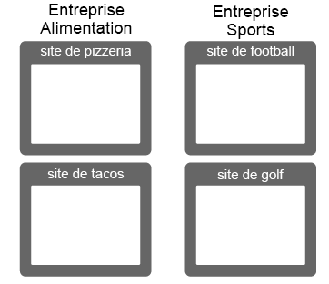
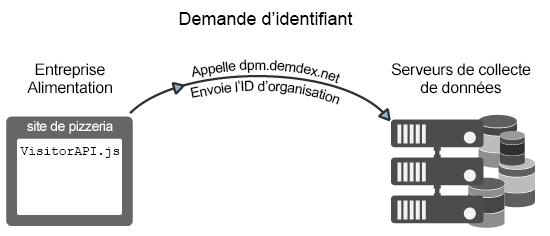
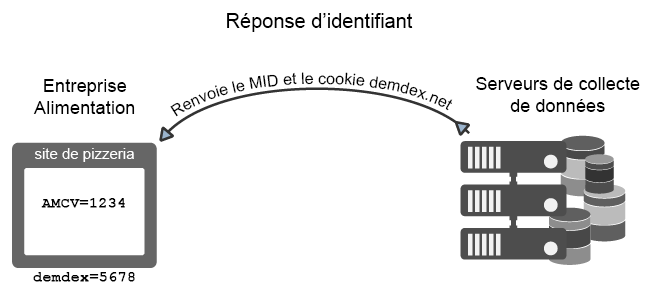
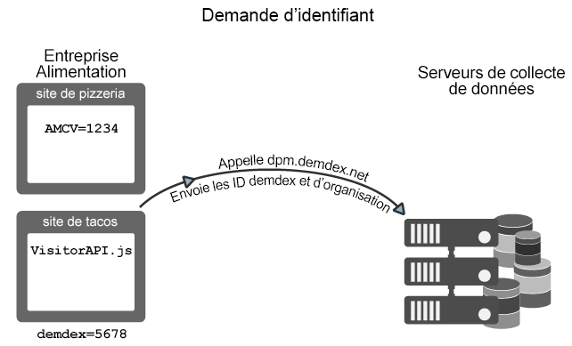
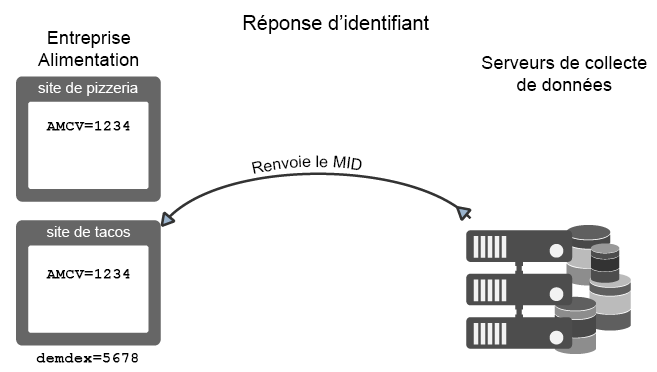
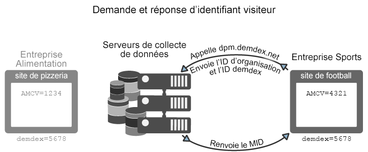

# Requête et définition d’ID par le service Experience Cloud Identity {#how-the-experience-cloud-id-service-requests-and-sets-ids}

Cette section décrit le processus de requête d’ID et de réponse. Ces exemples illustrent l’affectation d’ID sur chaque site, entre différents sites et pour les sites gérés par différents clients Experience Cloud avec leurs ID d’organisation.

>[!NOTE]
>
>Si vous ne savez pas comment le service Experience Cloud Identity crée un identifiant visiteur, prenez quelques instants pour consulter la section [Experience Cloud](../introduction/cookies.md).

**Conseil :** Consultez également notre [vidéo service d’ID sur le suivi inter-domaines](https://helpx.adobe.com/fr/marketing-cloud-core/kb/MCID/CrossDomain.html).

## Requête d’un Experience Cloud ID {#section-0b5e261fbd0547d9b9a1680e5ce536cc}

Les exemples ci-après montrent comment le service d’ID demande l’identifiant visiteur Experience Cloud et le reçoit. Ces exemples utilisent deux sociétés fictives, Food Company et Sports Company, pour illustrer les flux de données pour les requêtes d’ID et les réponses. Chaque société possède un ID d’organisation Experience Cloud unique et a implémenté le code du service d’ID sur tous ses sites. Ces cas d’utilisation représentent les flux de données pour une mise en œuvre générique du service d’ID sans Analytics, d’ID hérités ni de navigateurs qui bloquent les cookies tiers.

**Première requête**

Dans cet exemple, un nouveau visiteur se rend sur le site des pizzas géré par la société Food Company. La société Food Company a placé le code du service d’ID sur le site Web des pizzas. Lors du chargement du site des pizzas, le code du service d’ID recherche le cookie AMCV dans le domaine des pizzas.

* Si le cookie AMCV est défini, le visiteur du site dispose d’un Experience Cloud ID. Dans ce cas, le cookie effectue le suivi du visiteur et partage les données avec d’autres solutions Experience Cloud.
* Si le cookie AMCV n’est pas défini, le code du service d’ID appelle un [serveur de collecte de données régionale](https://experienceleague.adobe.com/docs/analytics/technotes/rdc/regional-data-collection.html?lang=en) (DCS) à l’adresse `dpm.demdex.net/id` (voir aussi [Signification des appels vers le domaine Demdex](https://experienceleague.adobe.com/docs/audience-manager/user-guide/reference/demdex-calls.html?lang=en). L’appel comprend l’ID d’organisation de la société Food Company. L’ID d’organisation est défini dans la fonction `Visitor.getInstance` du code du service d’ID.

**Première réponse**

Le serveur de collecte de données renvoie dans la réponse l’[!DNL Experience Cloud] ID (MID) et le cookie demdex. Le code du service d’ID écrit la valeur MID dans le cookie AMCV. Par exemple, supposons que le serveur de collecte de données renvoie une valeur MID de 1234. Il stockerait le cookie AMCV sous la forme `mid|1234` et le définirait dans le domaine pizza propriétaire. Le cookie demdex contient également un ID unique (appelons-le 5678). Ce cookie est défini dans le domaine demdex.net tiers, qui est distinct du domaine pizza.

Comme vous le verrez dans l’exemple suivant, l’ID demdex et l’ID d’organisation permettent au service d’ID de créer et de renvoyer le MID correct lorsque notre visiteur se rend sur un autre site appartenant à la société Food Company.

## Requête et réponse intersites {#section-15ea880453af467abd2874b8b4ed6ee9}

Dans cet exemple, le visiteur de la société Food Company passe du site des pizzas au site des tacos. La société Food Company a placé le code du service d’ID sur le site Web des tacos. Le visiteur n’a jamais été sur le site web des tacos.

Il n’existe donc pas de cookie AMCV sur le site des tacos. De plus, le service d’ID ne peut pas utiliser le cookie AMCV défini sur le site des pizzas, car il est spécifique au domaine pizza. En conséquence, le service d’ID doit appeler le serveur de collecte de données pour rechercher et demander un ID de visiteur. Dans le cas présent, l’appel du serveur de collecte de données comprend l’ID d’organisation *et* l’ID demdex. N’oubliez pas que l’ID demdex est récupéré sur le site des pizzas et stocké en tant que cookie tiers sous le domaine demdex.net.

Une fois que le serveur de collecte de données a reçu l’ID d’organisation et l’ID demdex, il crée et renvoie le MID correct pour notre visiteur de site. Comme le MID est dérivé de manière mathématique de l’ID d’organisation et de l’ID demdex, le cookie AMCV contient la valeur MID, `mid = 1234`.

## Requêtes d’ID depuis d’autres sites {#section-ba9a929e50d64b0aba080630fd83b6f1}

Dans cet exemple, notre visiteur quitte les sites de la société Food Company et accède au site de football appartenant à la Société Sports Company. Lorsque le visiteur se rend sur le site de football, le processus de vérification des identifiants et de demande fonctionne de la même manière que décrit dans les exemples précédents. Cependant, comme la société Sports Company possède son propre ID d’organisation, le service d’ID renvoie un autre MID. Le nouveau MID est unique aux domaines contrôlés par la société Sports Company et permet à celle-ci d’effectuer le suivi et de partager les données du visiteur dans l’ensemble des solutions [!DNL Experience Cloud]. L’ID demdex reste identique pour ce visiteur, car il contient un cookie tiers et persiste dans les différents domaines.

