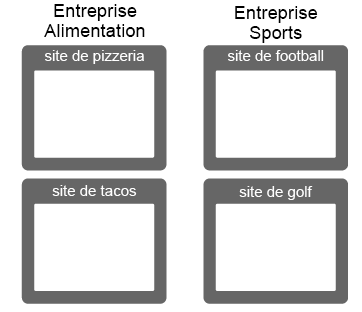
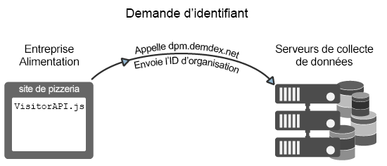
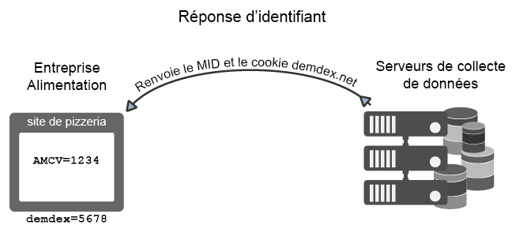
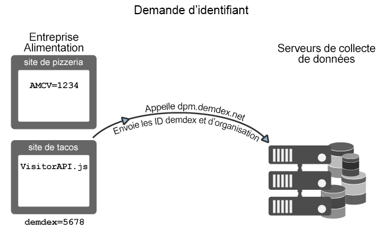
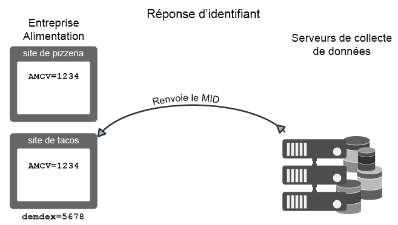
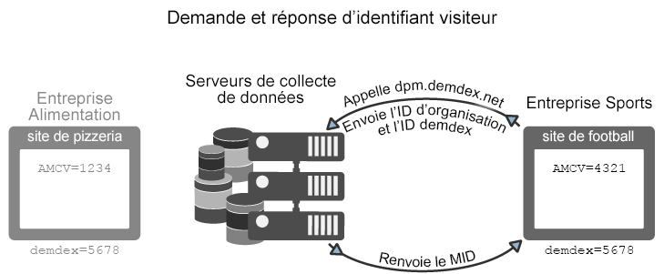

# Requête et définition d’ID par le service d’identification des visiteurs d’Adobe{#how-the-experience-cloud-id-service-requests-and-sets-ids}

Cette section décrit le processus de requête d’ID et de réponse. Ces exemples illustrent l’affectation d’ID sur chaque site, entre différents sites et pour les sites gérés par différents clients CX Enterprise avec leurs propres ID d’organisation IMS.

>[!NOTE]
>
>Si vous ne savez pas comment le service d’identification des visiteurs crée l’identifiant visiteur, prenez un moment pour consulter la section [ Cookies et service d’identification des visiteurs ](../introduction/cookies.md).

## Demande d’un ECID {#section-0b5e261fbd0547d9b9a1680e5ce536cc}

Les exemples suivants montrent comment le service d’identification des visiteurs demande et reçoit l’ECID. Ces exemples utilisent deux sociétés fictives, Food Company et Sports Company, pour illustrer les flux de données pour les requêtes d’ID et les réponses. Chaque société dispose d’un identifiant d’organisation IMS unique et a implémenté le code du service d’identification des visiteurs sur tous ses sites. Ces cas d’utilisation représentent des flux de données pour une implémentation générique du service d’identification des visiteurs sans Analytics, sans identifiants hérités, ni navigateurs qui bloquent les cookies tiers.

**Première requête**

Dans cet exemple, un nouveau visiteur se rend sur le site des pizzas géré par la société Food Company. La société alimentaire affiche le code du service d&#39;identification des visiteurs sur le site Web de la pizza. Lorsque le site de pizza se charge, le code du service d’identification des visiteurs recherche le cookie AMCV dans le domaine de la pizza.

* Si le cookie AMCV est défini, le visiteur du site dispose d’un ECID. Dans ce cas, le cookie suit le visiteur et partage les données avec d’autres solutions d’entreprise CX.
* Si le cookie AMCV n’est pas défini, le code du service d’identification des visiteurs appelle un [serveur de collecte de données](https://experienceleague.adobe.com/docs/analytics/technotes/rdc/regional-data-collection.html?lang=fr) (DCS) régional à l’`dpm.demdex.net/id` (voir également [Présentation des appels vers le domaine Demdex](https://experienceleague.adobe.com/docs/audience-manager/user-guide/reference/demdex-calls.html?lang=fr). L’appel comprend l’ID d’organisation IMS pour la société alimentaire. L’ID d’organisation IMS est défini dans la fonction `Visitor.getInstance` du code du service d’identification des visiteurs.

**Première réponse**

Dans la réponse, le serveur de collecte de données renvoie l’ECID et le cookie demdex. Le code du service d’identification des visiteurs écrit la valeur MID dans le cookie AMCV. Par exemple, supposons que le serveur de collecte de données renvoie une valeur MID de 1234. Il stockerait le cookie AMCV sous la forme `mid|1234` et le définirait dans le domaine pizza propriétaire. Le cookie demdex contient également un ID unique (appelons-le 5678). Ce cookie est défini dans le domaine demdex.net tiers, qui est distinct du domaine pizza.

Comme vous le verrez dans l’exemple suivant, l’identifiant demdex et l’identifiant d’organisation IMS permettent au service d’identification des visiteurs de créer et de renvoyer le MID correct lorsque notre visiteur se déplace vers un autre site appartenant à la société alimentaire.

## Requête et réponse intersites {#section-15ea880453af467abd2874b8b4ed6ee9}

Dans cet exemple, le visiteur de la société Food Company passe du site des pizzas au site des tacos. La société alimentaire a le code du service d&#39;identification des visiteurs sur le site web de tacos. Le visiteur n’a jamais été sur le site web des tacos.

Il n’existe donc pas de cookie AMCV sur le site des tacos. De plus, le service d’identification des visiteurs ne peut pas utiliser le cookie AMCV défini sur le site de pizza, car il est spécifique au domaine de la pizza. Par conséquent, le service d’identification des visiteurs doit appeler le serveur de collecte de données pour rechercher et demander un identifiant visiteur. Dans ce cas, l’appel DCS inclut l’ID d’organisation IMS de la société alimentaire *et* l’ID demdex. N’oubliez pas que l’ID demdex est récupéré sur le site des pizzas et stocké en tant que cookie tiers sous le domaine demdex.net.

Une fois que le serveur de collecte de données a reçu l’identifiant d’organisation IMS et l’identifiant demdex, il crée et renvoie le MID correct pour le visiteur de notre site. Comme le MID est dérivé mathématiquement de l’ID d’organisation IMS et de l’ID demdex, le cookie AMCV contient la valeur MID, `mid = 1234`.

## Requêtes d’ID depuis d’autres sites {#section-ba9a929e50d64b0aba080630fd83b6f1}

Dans cet exemple, notre visiteur quitte les sites de la société Food Company et accède au site de football appartenant à la Société Sports Company. Lorsque le visiteur se rend sur le site de football, le processus de vérification des identifiants et de demande fonctionne de la même manière que décrit dans les exemples précédents. Cependant, comme la société sportive possède son propre ID d’organisation IMS, le service d’identification des visiteurs renvoie un MID différent. Le nouveau MID est propre aux domaines contrôlés par la société sportive et permet à cette entreprise de suivre et de partager les données des visiteurs entre les solutions dans CX Enterprise. L’ID demdex reste identique pour ce visiteur, car il contient un cookie tiers et persiste dans les différents domaines.

