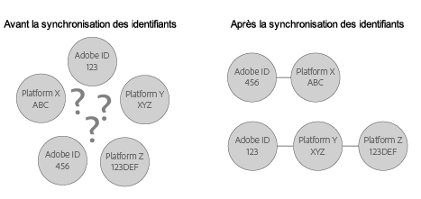

# Comprendre la synchronisation des identifiants et les taux de correspondance{#understanding-id-synchronization-and-match-rates}

Présentation des processus de synchronisation des identifiants et des taux de correspondance dans le service d’identification des visiteurs, y compris Adobe Media Optimizer et le service d’identification des visiteurs.

## Synchronisation des identifiants et taux de correspondance {#section-f652aae7234945e89d26dd833c5215fb}

La synchronisation des identifiants correspond aux identifiants affectés par le service d’identification des visiteurs aux identifiants affectés aux visiteurs du site par nos clients. Supposons, par exemple, que le service d’identification des visiteurs ait attribué un identifiant visiteur 1234. Une autre plateforme connaît ce visiteur comme possédant l’ID 4321. Le service d’identification des visiteurs mappe ces identifiants ensemble pendant le processus de synchronisation. Les résultats ajoutent de nouveaux points de données à ce que nos clients savent sur les visiteurs de leur site. De plus, si le service d’identification des visiteurs ne peut pas faire correspondre un identifiant, il en crée un et l’utilise pour une synchronisation ultérieure.

Les taux de correspondance mesurent et valident l’efficacité du processus de synchronisation des identifiants. Des taux de correspondance élevés suggèrent qu’un service particulier sera plus efficace et donnera accès à une plus large audience en ligne qu’un service avec des taux de correspondance faibles. La comparaison des taux de correspondance est un moyen quantifiable d’évaluer les différentes plateformes technologiques publicitaires intégrées.

**Assurer des taux de correspondance élevés**

Une implémentation appropriée permet d’assurer des taux de correspondance élevés, car permet au service d’identification des visiteurs de définir les cookies nécessaires au fonctionnement et à la synchronisation des identifiants avec les partenaires de données activés. Cependant, des facteurs tels que la lenteur des connexions Internet, la collecte de données à partir d’appareils mobiles ou de réseaux sans fil peuvent affecter la capacité du service d’identification des visiteurs à collecter, synchroniser et faire correspondre les identifiants. Ces variables côté client ne sont pas sous le contrôle du service d’identification des visiteurs ou d’Adobe.

## Description du processus de synchronisation des identifiants {#section-a541a85cbbc74f5682824b1a2ee2a657}

Le service d’identification des visiteurs synchronise les identifiants en temps réel. Ce processus fonctionne dans le navigateur plutôt que par le biais d’un transfert de données serveur à serveur. Le tableau suivant décrit les étapes du processus de synchronisation des identifiants.

**Étape 1 : chargement de la page**

Lorsqu’un visiteur se rend sur votre site et charge une page, la fonction `Visitor.getInstance` effectue un appel [CORS](../reference/cors.md#concept-6c280446990d46d88ba9da15d2dcc758) ou JSON-P au service d’identification des visiteurs. Le service d’identification des visiteurs répond avec un cookie qui inclut l’ECID du visiteur. Les MID est un ID unique attribué à chaque visiteur du site. Voir aussi [&#x200B; Cookies et service d’identification des visiteurs &#x200B;](../introduction/cookies.md).

**Étape 2 : Chargement de l’iFrame**

Pendant que le corps de la page se charge, le service d’identification des visiteurs charge un iFrame appelé *`Destination Publishing iFrame`*. Le [!UICONTROL Destination Publishing iFrame] se charge dans un domaine séparé de la page active. Cette conception permet d’assurer les performances des pages et d’améliorer la sécurité, car l’iFrame :

* Se charge de manière asynchrone par rapport à la page parente. Cela signifie que la page parente peut se charger indépendamment de [!UICONTROL Destination Publishing iFrame]. Le chargement de l’iFrame et des pixels de synchronisation des identifiants à partir de l’iFrame n’affecte pas la page parente ni l’expérience utilisateur.
* Charge aussi vite que possible. Si cette opération est trop rapide, vous pouvez charger l’iFrame après l’événement de chargement de la fenêtre (non recommandé). Voir [idSyncAttachIframeOnWindowLoad](../library/function-vars/idsyncattachiframeonwindowload.md#reference-b86b7112e0814a4c82c4e24c158508f4) pour plus de détails.
* Empêche le code de l’iFrame d’accéder à la page parente ou de l’affecter.

Consultez également la section [Requête et définition d’ID par le service d’identification des visiteurs...](../introduction/id-request.md#concept-2caacebb1d244402816760e9b8bcef6a).

**Étape 3 : Déclenchement de la synchronisation des ID**

La synchronisation des identifiants est une URL qui est déclenchée dans l’iFrame de publication de destination. Comme illustré dans cet exemple générique, une URL de synchronisation des identifiants contient le point d’entrée de synchronisation des identifiants d’un partenaire et une URL de redirection, qui est une redirection vers Adobe qui inclut son identifiant.

`http://abc.com?partner_id=abc&sync_id=123&redir=http://dpm.demdex.net/ibs:dpid=<ADOBE_PARTNER_ID>&dpuuid=<PARTNER_UUID>`

Voir également [Synchronisation des identifiants pour les transferts de données entrants](https://experienceleague.adobe.com/docs/audience-manager/user-guide/implementation-integration-guides/sending-audience-data/batch-data-transfer-process/id-sync-http.html?lang=fr).

**Étape 4 : Enregistrement des identifiants**

Les identifiants synchronisés sont enregistrés sur les [serveurs de données principaux et de périphérie](https://experienceleague.adobe.com/docs/audience-manager/user-guide/reference/system-components/components-edge.html?lang=fr).

## Les services de synchronisation gèrent la synchronisation des identifiants {#section-cd5784d7ad404a24aa28ad4816a0119a}

Le terme *`Sync Services`* fait référence aux technologies CX Enterprise internes responsables de la synchronisation des identifiants. Ce service est activé par défaut. Pour le désactiver, ajoutez une [variable facultative](../library/function-vars/disableidsync.md#reference-589d6b489ac64eddb5a7ff758945e414) à la fonction `Visitor.getInstance` du service d’identification des visiteurs. Les services de synchronisation correspondent à différents ECID, tels que :

* Identifiants de cookie d’entreprise CX tiers vers des ECID propriétaires.

* Identifiants de cookie d’entreprise CX propriétaires en identifiants Adobe Media Optimizer (AMO).

* ID de cookies d’entreprise CX tiers pour les ID de fournisseurs de données tiers et de plateforme de ciblage. Cela comprend les services et plateformes tels que les fournisseurs de données, les plateformes de demande et/ou côté fournisseurs, les réseaux publicitaires, les échanges, etc.
* Identifiants de cookie d’entreprise CX propriétaires aux identifiants de partenaire sur plusieurs appareils.

## Synchronisation des identifiants avec Adobe Advertising Cloud {#section-642c885ea65d45ffb761f78838735016}

Adobe Advertising Cloud (anciennement appelé Adobe Media Optimizer) fait exception au processus de synchronisation des identifiants basés sur iFrame. Advertising Cloud étant un domaine de confiance, les synchronisations des identifiants ont lieu à partir de la page parente plutôt que dans la [!UICONTROL Destination Publishing iFrame]. Pendant la synchronisation, le service d’identification des visiteurs appelle Advertising Cloud à l’adresse `cm.eversttech.net`. Il s’agit d’un nom de domaine hérité utilisé par Advertising Cloud avant son acquisition par Adobe. L’envoi de données à Advertising Cloud permet d’améliorer les taux de correspondance et est automatique pour les clients du service d’identification des visiteurs qui utilisent la version 2.0 (ou ultérieure). Voir également [Cookies Advertising Cloud](https://experienceleague.adobe.com/docs/core-services/interface/administration/ec-cookies/cookies-advertising-cloud.html?lang=fr).

>[!MORELIKETHIS]
>
>* [Signification des appels vers le domaine Demdex](https://experienceleague.adobe.com/docs/audience-manager/user-guide/reference/demdex-calls.html?lang=fr)

