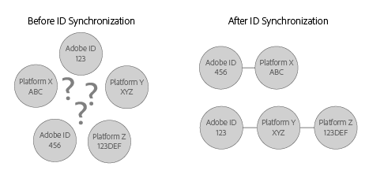

# Comprendre la synchronisation des identifiants et les taux de correspondance {#understanding-id-synchronization-and-match-rates}

Une vue d’ensemble des processus de synchronisation des identifiants et des taux de correspondance dans le service Experience Cloud Identity, y compris Adobe Media Optimizer et le service d’ID.

## Synchronisation des identifiants et taux de correspondance {#section-f652aae7234945e89d26dd833c5215fb}

La synchronisation des identifiants fait correspondre les identifiants attribués par le service d’ID aux identifiants attribués aux visiteurs du site par nos clients. Par exemple, supposons que le service d’ID ait attribué un ID de visiteur 1234. Une autre plate-forme connaît ce visiteur comme possédant l’ID 4321. Le service d’ID associe ces ID lors du processus de synchronisation. Les résultats ajoutent de nouveaux points de données à ce que nos clients savent sur les visiteurs de leur site. Et si le service d’ID ne peut pas faire correspondre un ID, il en crée un nouveau et l’utilise pour une synchronisation ultérieure.

Les taux de correspondance mesurent et valident l’efficacité du processus de synchronisation des identifiants. Des taux de correspondance élevés suggèrent qu’un service particulier sera plus efficace et donnera accès à une plus large audience en ligne qu’un service avec des taux de correspondance faibles. La comparaison des taux de correspondance est un moyen quantifiable d’évaluer les différentes plateformes technologiques publicitaires intégrées.

**Assurer des taux de correspondance élevés**

Pour générer des taux de correspondance élevés, il est important de bien configurer le service d’ID (voir le [guide de mise en œuvre standard](../implementation-guides/standard.md#concept-89cd0199a9634fc48644f2d61e3d2445)). Une mise en œuvre appropriée permet d’assurer des taux de correspondance élevés, car elle permet au service d’ID de définir les cookies dont il a besoin pour fonctionner et synchroniser les identifiants avec les partenaires de données activés. Cependant, des facteurs tels que la lenteur des connexions Internet, la collecte de données à partir de périphériques mobiles ou de réseaux sans fil peuvent affecter la collecte, la synchronisation et la correspondance des identifiants du service d’ID. Ces variables côté client dépassent le champ d’action du service d’ID ou d’[!DNL Adobe].

## Description du processus de synchronisation des identifiants {#section-a541a85cbbc74f5682824b1a2ee2a657}

Le service d’ID synchronise les identifiants en temps réel. Ce processus fonctionne dans le navigateur plutôt que par le biais d’un transfert de données serveur à serveur. Le tableau suivant décrit les étapes du processus de synchronisation des identifiants.

**Étape 1 : Chargement de la page**

Lorsqu’un visiteur se rend sur votre site et charge une page, la fonction `Visitor.getInstance`lance un appel [CORS](../reference/cors.md#concept-6c280446990d46d88ba9da15d2dcc758) ou JSON-P au service d’ID. Le service d’ID répond avec un cookie qui inclut l’[!DNL Experience Cloud] ID (MID) du visiteur. Les MID est un identifiant unique attribué à chaque visiteur du site. Voir aussi [Cookies et service Experience Cloud Identity](../introduction/cookies.md).

**Étape 2 : Chargement de l’iFrame**

Pendant que le corps de la page se charge, le service d’ID charge une iFrame appelée *`Destination Publishing iFrame`*. L’[!UICONTROL iFrame de publication de destination] se charge dans un domaine séparé de la page parente. Cette conception permet d’assurer les performances des pages et d’améliorer la sécurité, car l’iFrame :

* Se charge de manière asynchrone par rapport à la page parente. Cela signifie que la page parente peut se charger indépendamment de l’[!UICONTROL iFrame de publication de destination]. Le chargement de l’iFrame et des pixels de synchronisation des identifiants à partir de l’iFrame n’affecte pas la page parente ni l’expérience utilisateur.
* Charge aussi vite que possible. Si cette opération est trop rapide, vous pouvez charger l’iFrame après l’événement de chargement de la fenêtre (non recommandé). Voir [idSyncAttachIframeOnWindowLoad](../library/function-vars/idsyncattachiframeonwindowload.md#reference-b86b7112e0814a4c82c4e24c158508f4) pour plus de détails.
* Empêche le code de l’iFrame d’accéder à la page parente ou de l’affecter.

Consultez également la section [Requête et définition d’ID par le service Experience Cloud Identity...](../introduction/id-request.md#concept-2caacebb1d244402816760e9b8bcef6a).

**Étape 3 : Déclenchement de la synchronisation des ID**

La synchronisation des identifiants est une URL qui est déclenchée dans l’iFrame de publication de destination. Comme l’exemple générique le montre, une URL de synchronisation des identifiants contient le point de terminaison de la synchronisation des identifiants d’un partenaire, ainsi qu’une URL de redirection, qui redirige vers [!DNL Adobe] avec leur identifiant.

`http://abc.com?partner_id=abc&sync_id=123&redir=http://dpm.demdex.net/ibs:dpid=<ADOBE_PARTNER_ID>&dpuuid=<PARTNER_UUID>`

Voir également [Synchronisation des identifiants pour les transferts de données entrants](https://docs.adobe.com/content/help/fr-FR/audience-manager/user-guide/implementation-integration-guides/sending-audience-data/batch-data-transfer-process/id-sync-http.html).

**Étape 4 : Enregistrement des identifiants**

Les identifiants synchronisés sont enregistrés sur les [serveurs de données principaux et de périphérie](https://docs.adobe.com/content/help/fr-FR/audience-manager/user-guide/reference/system-components/components-edge.html).

## Les services de synchronisation gèrent la synchronisation des identifiants {#section-cd5784d7ad404a24aa28ad4816a0119a}

Le terme *`Sync Services`* fait référence aux technologies internes [!DNL Experience Cloud] responsables de la synchronisation des identifiants. Ce service est activé par défaut. Pour le désactiver, ajoutez une [variable optionnelle](../library/function-vars/disableidsync.md#reference-589d6b489ac64eddb5a7ff758945e414) à la fonction du service d’ID `Visitor.getInstance`. Les services de synchronisation établissent des correspondances entre différents [!DNL Experience Cloud] ID, tels que :

* Les identifiants de [!DNL Experience Cloud] cookie tiers et les [!DNL Experience Cloud] identifiants propriétaires.

* Les identifiants de [!DNL Experience Cloud] cookie propriétaires et les identifiants [!DNL Adobe Media Optimizer] (AMO).

* Les identifiants de cookie tiers [!DNL Experience Cloud] et les identifiants des fournisseurs de données et des plateformes de ciblage tiers. Cela comprend les services et plateformes tels que les fournisseurs de données, les plateformes de demande et/ou côté fournisseurs, les réseaux publicitaires, les échanges, etc.
* Les identifiants de [!DNL Experience Cloud] cookie propriétaires et les identifiants des partenaires opérant sur plusieurs appareils.

## Synchronisation des identifiants avec Adobe Advertising Cloud {#section-642c885ea65d45ffb761f78838735016}

[!DNL Adobe Advertising Cloud] (précédemment appelé [!DNL Adobe Media Optimizer]) est une exception au processus de synchronisation des identifiants basé sur l’iFrame. Comme [!DNL Advertising Cloud] est un domaine de confiance, les synchronisations des identifiants ont lieu à partir de la page parente plutôt que dans l’[!UICONTROL iFrame de publication de destination]. Pendant la synchronisation, le service d’ID appelle [!DNL Advertising Cloud] à l’adresse `cm.eversttech.net`, qui est un nom de domaine hérité utilisé par [!DNL Advertising Cloud] avant son acquisition par Adobe. L’envoi de données à [!DNL Advertising Cloud] permet d’améliorer les taux de correspondance et est automatique pour les clients du service d’ID utilisant la version 2.0 (ou ultérieure). Voir également [Cookies Advertising Cloud](https://docs.adobe.com/content/help/fr-FR/core-services/interface/ec-cookies/cookies-advertising-cloud.html).

>[!MORELIKETHIS]
>
>* [Signification des appels vers le domaine Demdex](https://docs.adobe.com/content/help/fr-FR/audience-manager/user-guide/reference/demdex-calls.html)

