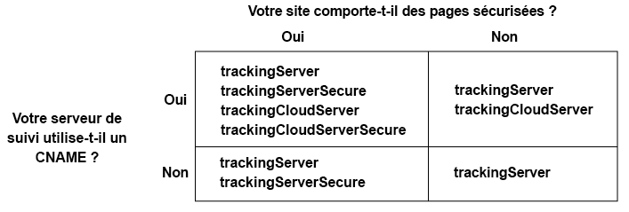

# Mise en œuvre du service Experience Cloud ID pour Analytics et Audience Manager{#implement-the-experience-cloud-id-service-for-analytics-and-audience-manager}

Ces instructions concernent les clients d’Analytics et d’Audience Manager qui souhaitent utiliser le service Experience Cloud ID et n’utilisent pas Dynamic Tag Management (DTM). Cependant, nous vous recommandons vivement d’utiliser DTM pour mettre en œuvre le service d’ID. DTM facilite le workflow de mise en œuvre et assure automatiquement le placement et le séquencement adéquats du code.

>[!IMPORTANT]
>
>* [Lisez les conditions requises](../mcvid-reference/mcvid-requirements.md) avant de commencer.
>* Cette procédure nécessite AppMeasurement. Les clients qui utilisent s_code ne peuvent pas effectuer cette procédure.
>* Configurez ce code et testez-le dans un environnement de développement avant de le mettre en œuvre en production.
>


## Étape 1 : Planifier le transfert côté serveur {#section-880797cc992d4755b29cada7b831f1fc}

En plus des étapes décrites ici, les clients qui utilisent [!DNL Analytics] et [!DNL Audience Manager] doivent passer au transfert côté serveur. Le transfert côté serveur vous permet de supprimer le DIL (le code de collecte des données d’Audience Manager) et de le remplacer par le [Module de Gestion de l’audience](https://marketing.adobe.com/resources/help/en_US/aam/c_profiles_audiences.html). Voir la [documentation du transfert côté serveur](https://marketing.adobe.com/resources/help/en_US/analytics/audiences/ssf.html) pour en savoir plus.

La migration vers le transfert côté serveur nécessite des préparations et de la coordination. Ce processus implique des modifications externes du code de votre site et des étapes internes qu’Adobe doit effectuer pour configurer votre compte. En fait, nombre de ces procédures de migration doivent être effectuées en parallèle et être mises en production en même temps. Votre parcours de mise en œuvre doit suivre cette séquence d’événements :

1. Travaillez avec vos contacts [!DNL Analytics] et [!DNL Audience Manager] pour préparer votre migration du service d’ID et du transfert côté serveur. Faites en sorte que la sélection du serveur de suivi soit un aspect essentiel de ce plan.

1. Obtenez les privilèges d&#39;accès [!DNL Profiles & Audiences]pour. Pour démarrer, remplissez le formulaire sur le [site d’intégration et de mise en service](https://adobe.allegiancetech.com/cgi-bin/qwebcorporate.dll?idx=X8SVES).

1. Mettez en œuvre le service d&#39;ID et la [!DNL Audience Management Module] simultané. Pour fonctionner correctement, le [!DNL Audience Management Module] transfert côté serveur et le service d&#39;ID doivent être publiés pour le même ensemble de pages et au même moment.

## Étape 2 : Téléchargement du code du service d&#39;ID {#section-0780126cf43e4ad9b6fc5fe17bb3ef86}

Le service d’ID requiert la bibliothèque de code `VisitorAPI.js`. Pour télécharger cette bibliothèque de code :

1. Accédez à **[!UICONTROL Admin]** &gt; **[!UICONTROL Gestionnaire de code]**.

1. Dans Gestionnaire de code, cliquez sur **[!UICONTROL JavaScript (nouveau)]** ou sur **[!UICONTROL JavaScript (hérité)]**. Les bibliothèques de code compressées sont alors téléchargées.

1. Décompressez le fichier de code, puis ouvrez le fichier `VisitorAPI.js`.

## Étape 3 : Ajout de la fonction Visitor. getinstance au code du service d&#39;ID {#section-9e30838b4d0741658a7a492153c49f27}

>[!IMPORTANT]
>
>* Les versions précédentes de l’API du service d’ID plaçaient cette fonction à un autre emplacement et nécessitaient une syntaxe différente. Si vous effectuez une migration à partir d’une version antérieure à la [version 1.4](../mcvid-release-notes/mcvid-notes-2015.md#section-f5c596f355b14da28f45c798df513572), prenez note du nouvel emplacement et de la nouvelle syntaxe documentés dans cette section.
>* Le code dans ALL CAPS est un espace réservé pour les valeurs réelles. Remplacez ce texte par votre ID d’organisation, l’URL du serveur de suivi ou une autre valeur de nom.
>


**Partie 1 : Copiez la fonction Visitor.getInstance ci-dessous**

```js
var visitor = Visitor.getInstance("INSERT-MARKETING-CLOUD-ORGANIZATION ID-HERE", { 
     trackingServer: "INSERT-TRACKING-SERVER-HERE", // same as s.trackingServer 
     trackingServerSecure: "INSERT-SECURE-TRACKING-SERVER-HERE", // same as s.trackingServerSecure 
 
     // To enable CNAME support, add the following configuration variables 
     // If you are not using CNAME, DO NOT include these variables 
     marketingCloudServer: "INSERT-TRACKING-SERVER-HERE", 
     marketingCloudServerSecure: "INSERT-SECURE-TRACKING-SERVER-HERE" // same as s.trackingServerSecure 
}); 
```

**Partie 2 : Ajoutez le code de la fonction au fichier Visitor API.js**

Placez la fonction `Visitor.getInstance` à la fin du fichier, après le bloc de code. Le fichier modifié doit ressembler à celui-ci :

```js
/* 
========== DO NOT ALTER ANYTHING BELOW THIS LINE ========== 
Version and copyright section 
*/ 
 
// Visitor API code library section 
 
// Put Visitor.getInstance at the end of the file, after the code library 
 
var visitor = Visitor.getInstance("INSERT-MARKETING-CLOUD-ORGANIZATION ID-HERE", { 
     trackingServer: "INSERT-TRACKING-SERVER-HERE", // same as s.trackingServer 
     trackingServerSecure: "INSERT-SECURE-TRACKING-SERVER-HERE", // same as s.trackingServerSecure 
 
     // To enable CNAME support, add the following configuration variables 
     // If you are not using CNAME, DO NOT include these variables 
     marketingCloudServer: "INSERT-TRACKING-SERVER-HERE", 
     marketingCloudServerSecure: "INSERT-SECURE-TRACKING-SERVER-HERE" // same as s.trackingServerSecure 
}); 
```

## Étape 4 : Ajout de votre ID d&#39;organisation Experience Cloud à Visitor. getinstance {#section-e2947313492546789b0c3b2fc3e897d8}

Dans `Visitor.getInstance` la fonction, remplacez `INSERT-MARKETING-CLOUD-ORGANIZATION ID-HERE` par votre ID d&#39;organisation Experience Cloud. Si vous ne connaissez pas votre ID d’organisation, vous pouvez le trouver dans la page d’administration Experience Cloud. La fonction modifiée peut ressembler à l’exemple ci-après.

`var visitor = Visitor.getInstance("1234567ABC@AdobeOrg", { ...`

>[!IMPORTANT]
>
>*Ne* modifiez pas la casse des caractères de votre ID d&#39;organisation. L’ID est sensible à la casse et doit être utilisé tel quel.

## Étape 5 : Ajout de vos serveurs de suivi à Visitor. getinstance {#section-0dfc52096ac2427f86045aab9a0e0dfc}

Analytics utilise des serveurs de suivi pour la collecte des données.

**Partie 1 : Recherchez les URL de serveur de suivi**

Vérifiez les `s_code.js` URL de serveur de suivi dans vos fichiers ou `AppMeasurement.js` fichiers. Les URL doivent être spécifiées par les variables suivantes :

* `s.trackingServer`
* `s.trackingServerSecure`

**Partie 2 : Définissez les variables de serveur de suivi**

Pour déterminer les variables de serveur de suivi à utiliser, procédez comme suit :

1. Répondez aux questions présentées dans le tableau ci-après. Utilisez les variables qui correspondent à vos réponses.
1. Remplacez les espaces réservés de serveur de suivi par vos URL de serveur de suivi.
1. Supprimez les variables de serveur de suivi et de serveur Experience Cloud inutilisées du code.



>[!NOTE]
>
>Lorsqu&#39;elles sont utilisées, faites correspondre les URL du serveur Experience Cloud aux URL de serveur de suivi correspondantes comme suit :

* URL du serveur Experience Cloud = URL du serveur de suivi
* URL du serveur sécurisé Experience Cloud = URL du serveur sécurisé de suivi

Si vous ne savez pas comment trouver votre serveur de suivi, voir [Question fréquentes](../mcvid-faq-intro/ecid-faq.md) et [Définition correcte des variables trackingServer et trackingServerSecure](https://helpx.adobe.com/analytics/kb/determining-data-center.html#).

## Étape 6 : Mettez à jour votre fichier appmeasurement. js {#section-5517e94a09bc44dfb492ebca14b43048}

Cette étape nécessite [!DNL AppMeasurement]. Vous ne pouvez pas continuer si vous utilisez toujours s_code.

Ajoutez `Visitor.getInstance` la fonction illustrée ci-dessous à `AppMeasurement.js` votre fichier. Placez-le dans la section contenant des configurations telles `linkInternalFilters`que `charSet`, `trackDownloads`etc. :

`s.visitor = Visitor.getInstance("INSERT-MARKETING-CLOUD-ORGANIZATION ID-HERE");`

>[!IMPORTANT]
>
>A ce stade, supprimez le code [!DNL Audience Manager] DIL et remplacez-le par le module de gestion de l&#39;audience. Voir [Mise en œuvre du transfert côté serveur](https://marketing.adobe.com/resources/help/en_US/reference/ssf.html) pour obtenir des instructions.

***(Étape facultative mais recommandée)*Créez une prop personnalisée**

Définir une prop personnalisée dans le fichier `AppMeasurement.js` pour mesurer la couverture. Ajoutez la prop personnalisée suivante à la fonction `doPlugins` de votre fichier `AppMeasurement.js` :

```js
// prop1 is used as an example only. Choose any available prop. 
s.prop1 = (typeof(Visitor) != "undefined" ? "VisitorAPI Present" : "VisitorAPI Missing");
```

## Étape 7 : Ajout du code de l&#39;API visiteur à la page {#section-c2bd096a3e484872a72967b6468d3673}

Placez ` [!DNL VisitorAPI.js]` le fichier dans `<head>` les balises de chaque page. Lorsque vous placez le fichier `VisitorAPI.js` sur votre page :

* Placez-le au début de `<head>` la section pour qu&#39;il s&#39;affiche avant les balises de la solution.
* Il doit s’exécuter avant AppMeasurement et le code d’autres solutions [!DNL Experience Cloud].

## Étape 8 : (Facultatif) Configuration d&#39;une période de grâce {#section-aceacdb7d5794f25ac6ff46f82e148e1}

Si l&#39;un de ces cas d&#39;utilisation s&#39;applique à votre situation, demandez [à l&#39;assistance](https://helpx.adobe.com/marketing-cloud/contact-support.html) clientèle de configurer une période de [grâce temporaire](../mcvid-reference/mcvid-analytics-reference/mcvid-grace-period.md). Les périodes de grâce peuvent durer jusqu’à 180 jours. En cas de besoin, vous pouvez renouveler une période de grâce.

**Mise en œuvre partielle**

Vous avez besoin d’une période de grâce si certaines pages utilisent le service d’ID et d’autres pas et si elles signalent des informations dans la même suite de rapports Analytics. Il s’agit d’une situation courante si vous disposez d’une suite de rapports globale qui signale des informations entre les domaines.

Interrompez la période de grâce une fois que le service d’ID est déployé sur toutes les pages Web qui signalent des informations dans la même suite de rapports.

**Exigences liées au cookie s_vi**

Vous avez besoin d’une période de grâce si les nouveaux visiteurs doivent avoir un cookie s_vi une fois la migration vers le service d’ID effectuée. Cette situation est courante si votre mise en œuvre lit le cookie s_vi et le stocke dans une variable.

Interrompez la période de grâce une fois que votre mise en œuvre peut capturer le MID au lieu de lire le cookie s_vi.

Voir aussi [Cookies et service Experience Cloud ID](../mcvid-introduction/mcvid-cookies.md).

**Intégration des données du parcours de navigation**

Vous avez besoin d’une période de grâce si vous envoyez les données à un système interne à partir d’un flux de données de parcours de navigation et si ce processus utilise les colonnes `visid_high` et `visid_low`.

Interrompez la période de grâce une fois que le processus d&#39;ingestion des données peut utiliser les colonnes `post_visid_high` et les `post_visid_low` colonnes.

Voir également [Référence des colonnes de données du parcours de navigation](https://marketing.adobe.com/resources/help/en_US/sc/clickstream/datafeeds_reference.html).

## Étape 9 : Test et déploiement du code du service d&#39;ID {#section-f857542bfc70496dbb9f318d6b3ae110}

Vous pouvez tester et déployer les éléments suivants.

**Tester et vérifier**

Pour tester la mise en œuvre du service d’ID, recherchez les éléments suivants :

* [le cookie AMCV](../mcvid-introduction/mcvid-cookies.md) dans le domaine où est hébergée votre page.
* la valeur du MID dans la demande d’image Analytics à l’aide de l’[outil de débogage Adobe](https://marketing.adobe.com/resources/help/en_US/sc/implement/debugger.html).
* See also, [Test and Verify the Experience Cloud ID Service](../mcvid-implementation-guides/mcvid-test-verify.md).

Pour vérifier le transfert côté serveur, consultez [Comment vérifier la mise en œuvre de votre transfert côté serveur](https://marketing.adobe.com/resources/help/en_US/reference/ssf-verify.html).

**Déploiement**

Déployez votre code une fois qu’il a réussi les tests.

Si vous avez activé une période de grâce :

* Vérifiez que l’Analytics ID (AID) et le MID figurent dans la demande d’image.
* Souvenez-vous de désactiver la période de grâce lorsque les critères d’interruption sont remplis.

