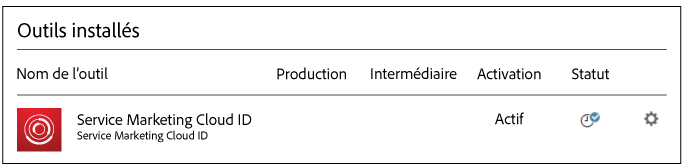
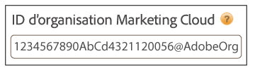
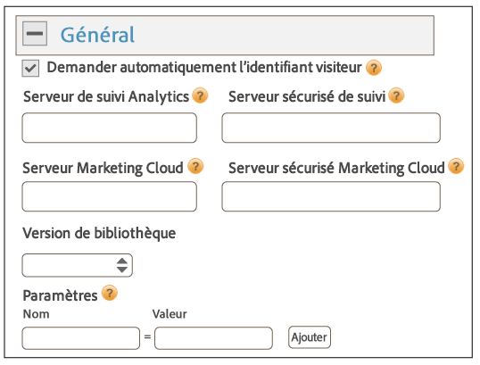
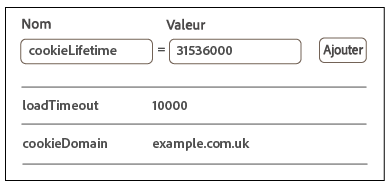
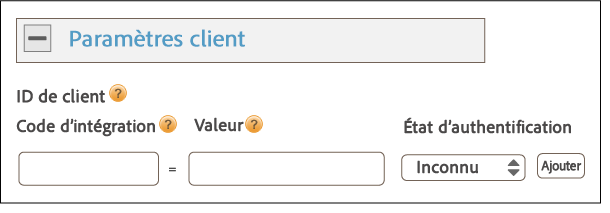
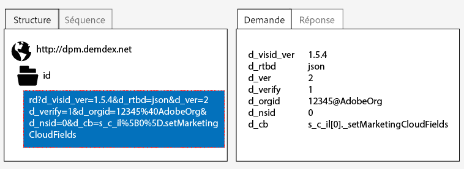
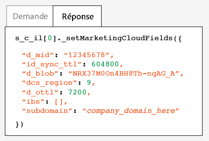
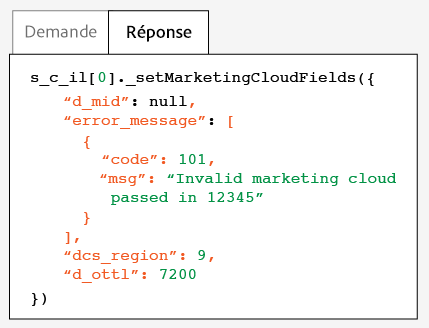

# Implémentation avec la gestion dynamique des balises{#implementation-with-dynamic-tag-management}

Les mises en œuvre précédentes utilisaient Dynamic Tag Management (DTM) pour configurer, déployer et intégrer le service Experience Cloud ID à vos autres solutions Experience Cloud.

## Implémentation avec la gestion dynamique des balises {#topic-6f4ed5d96977406ca991e50f3fbd5b01}

Les mises en œuvre précédentes utilisaient Dynamic Tag Management (DTM) pour configurer, déployer et intégrer le service Experience Cloud ID à vos autres solutions Experience Cloud.

>[!NOTE]
>
>[Actuellement, le lancement d&#39;Adobe](https://docs.adobelaunch.com/) est l&#39;outil d&#39;implémentation préféré et recommandé, car il permet de simplifier les tâches complexes de gestion des balises et d&#39;automatiser le placement du code au-delà des fonctionnalités de la gestion dynamique des balises. Voir [Implémentation avec Lancer](../mcvid-implementation-guides/ecid-implement-with-launch.md).

## Dynamic Tag Management et service d’ID {#section-4a4c4fac5d0a4cbbaff8e1833f73657c}

[La gestion dynamique des balises](https://marketing.adobe.com/resources/help/en_US/dtm/) vous permet de configurer, déployer et gérer votre instance de service d&#39;ID et les intégrations [!DNL Experience Cloud] de solutions associées. DTM aide à simplifier le processus de mise en œuvre parce qu’il est profondément intégré au service d’ID et aux autres solutions Experience Cloud. Ajoutez simplement l’outil Experience Cloud ID et configurez-le, puis définissez des informations, telles que :

* ID d’organisation d’Experience Cloud (automatiquement renseigné s’il est lié à Experience Cloud)
* Serveur de suivi Analytics (sécurisé et non sécurisé)
* Serveur Experience Cloud (pour les serveurs de suivi propriétaires)

DTM est mise gratuitement à disposition de tous les clients [!DNL Experience Cloud].

**Prise en main de la gestion dynamique des balises**

DTM est un outil simple, mais puissant. Si vous ne l’utilisez pas déjà, nous vous recommandons vivement de le faire. Voir la [documentation](https://marketing.adobe.com/resources/help/en_US/dtm/c_overview.html) DTM et la [vidéo de prise en main de DTM](https://marketing.adobe.com/resources/help/en_US/dtm/jump-start-videos.html) pour démarrer avec ce service. Pour obtenir des instructions relatives à la configuration du service d’ID avec DTM, voir les informations et procédures des sections ci-dessous.

## Instructions relatives au déploiement {#concept-54a2ec49af8f4bfca9207b1d404e8e1a}

Consultez les conditions requises et procédures suivantes avant d’essayer de mettre en œuvre le service Experience Cloud ID avec Dynamic Tag Management (DTM).

<!--
mcvid-dtm-deployment.xml
-->

**Configuration de votre compte**

Avant de commencer, assurez-vous que votre organisation et vos solutions ont été configurées pour l&#39; [!DNL Experience Cloud] ensemble [!DNL Dyanamic Tag Management]de vos activités. Cette documentation peut vous aider à démarrer :

* [Activez vos solutions pour les services principaux](https://marketing.adobe.com/resources/help/en_US/mcloud/core_services.html): Mettez en œuvre Experience Cloud et devenez un administrateur. Ce processus modernise vos solutions en ce qui concerne les services principaux tels que les attributs du client et les audiences Experience Cloud.
* [Prise en main de Dynamic Tag Management](https://marketing.adobe.com/resources/help/en_US/dtm/get_started.html)
* [Vidéos de démarrage](https://marketing.adobe.com/resources/help/en_US/dtm/jump-start-videos.html): Série de vidéos courtes montrant comment exécuter des tâches DTM de base.

**Placement et ordre de chargement du code du service d&#39;ID**

Le service d’ID fonctionne en demandant et en recevant un identifiant unique à partir des serveurs de collecte des données [!DNL Adobe]. Pour fonctionner correctement, le code du service d’ID doit être :

* Le premier bloc de code [!DNL Adobe] qui s’exécute sur la page.
* Placé aussi haut que possible sur la page, généralement dans le bloc `<head>` de codes.

Tant que vous conservez toutes vos solutions et bibliothèques de code [!DNL Adobe] dans DTM, il fera en sorte que le code de votre service d’ID soit situé au bon endroit et qu’il s’exécute au bon moment.

**Validation de la collecte des données régionales**

Les clients doivent fournir un CNAME ou utiliser [!DNL *.sc.omtrdc] la [collecte](https://marketing.adobe.com/resources/help/en_US/whitepapers/rdc/) de données régionale. Demandez à votre consultant [!DNL Adobe] de vous fournir les paramètres RDC spécifiques.

**Configuration des suites de rapports Analytics**

Les nouveaux clients [!DNL Analytics] doivent [créer une suite de rapports](https://marketing.adobe.com/resources/help/en_US/reference/new_report_suite.html) pour la collecte des données.

## Mise en œuvre du service Experience Cloud ID à l’aide de DTM {#task-a659cf19dea84ad48edabe0b72ef9f5c}

Suivez les étapes suivantes pour mettre en œuvre le service d’ID avec Dynamic Tag Management (DTM).

**Conditions préalables**

* Activez vos solutions pour [!DNL Experience Cloud] et vérifiez que vous disposez des autorisations de niveau administrateur. Voir [Activation de vos solutions pour les services principaux](https://marketing.adobe.com/resources/help/en_US/mcloud/core_services.html).

* Création d’une propriété Web dans DTM. Voir la documentation DTM [Création d’une propriété Web](https://marketing.adobe.com/resources/help/en_US/dtm/web_property.html) ou la [vidéo de prise en main rapide pour les administrateurs](https://marketing.adobe.com/resources/help/en_US/dtm/admin-jump-start.html).

<!--
mcvid-dtm-implement.xml
-->

**Procédure de mise en œuvre** Pour mettre en œuvre le service d&#39;ID avec DTM :

1. Dans la gestion dynamique des balises [!DNL Dashboard], cliquez sur la propriété web avec laquelle vous souhaitez travailler.
1. Dans l&#39;onglet **[!UICONTROL Aperçu]** de la propriété Web sélectionnée, cliquez **[!UICONTROL sur Ajouter un outil]**.
1. Dans **[!UICONTROL la liste Type]** d&#39;outil, cliquez sur **[!UICONTROL Service Experience Cloud ID]**.

   >[!NOTE]
   >
   >Cette action renseigne la zone ID d&#39;organisation **[!UICONTROL Experience]** Cloud avec votre ID d&#39;organisation. Si votre compte DTM n’est pas associé à [!DNL Experience Cloud], vous devrez fournir cet ID. Pour associer votre compte, voir [Association des comptes dans Experience Cloud](https://marketing.adobe.com/resources/help/en_US/mcloud/organizations.html). Voir les [conditions requises](../mcvid-reference/mcvid-requirements.md#section-a02f537129a64ffbb690d5738d360c26) pour obtenir des informations sur la manière de trouver votre ID d’organisation.

1. Tapez le nom de votre serveur de suivi dans **[!UICONTROL la zone Serveur]** de suivi. Si vous ne savez pas comment trouver votre serveur de suivi, reportez-vous aux [sections FAQ](../mcvid-faq-intro/mcvid-faq.md) et [Renseignement correct des variables trackingserver et trackingserversecure](https://helpx.adobe.com/analytics/kb/determining-data-center.html#).
1. Cliquez **[!UICONTROL sur Créer l&#39;outil]** et **[!UICONTROL Enregistrer les modifications]**.

   Après l’enregistrement, le service d’ID est configuré en tant qu’outil dans DTM. Cependant, il n’est pas encore prêt à l’emploi. Votre outil DTM doit encore passer le processus de publication/d’approbation de DTM, et vous avez l’occasion de configurer des paramètres supplémentaires. Pour plus d’informations sur le processus d’approbation de DTM, voir la vidéo [Prise en main rapide des fondamentaux pour les utilisateurs](https://marketing.adobe.com/resources/help/en_US/dtm/user-basics-jump-start.html). Pour obtenir des informations sur les paramètres supplémentaires que vous pouvez ajouter à DTM, voir [Paramètres du service Experience Cloud ID pour DTM](../mcvid-implementation-guides/mcvid-standard.md#concept-fb6cb6a0e6cc4f10b92371f8671f6b59).

>[!MORE_ LIKE_ THIS]
>
>* [Propriétés Web](https://marketing.adobe.com/resources/help/en_US/dtm/web_property.html)


## Paramètres du service Experience Cloud ID pour DTM {#concept-fb6cb6a0e6cc4f10b92371f8671f6b59}

Décrit les champs [!DNL Organization ID]et [!DNL General] les [!DNL Customer Settings] champs et leur mode d&#39;utilisation par le service [!DNL Experience Cloud] d&#39;ID.

<!--
mcvid-dtm-settings.xml
-->

## Comment trouver ces paramètres ? {#section-c5b2d1c928944ae2b8565c1b182fe575}

Les paramètres sont disponibles une fois que vous avez ajouté et enregistré le service d’ID en tant qu’outil dans Dynamic Tag Management (DTM). Vous pouvez également accéder à ces paramètres en cliquant sur l&#39;icône représentant un engrenage dans la [!DNL Installed Tools] section de la propriété Web de la gestion dynamique des balises.



## ID d’organisation {#section-949b5a0d8af940558b04ff675cf53f77}

ID requis et associé à votre société [!DNL Experience Cloud] configurée. Une organisation est l’entité qui permet à un administrateur de configurer des groupes et des utilisateurs et de contrôler l’accès par authentification unique à [!DNL Experience Cloud]. L’ID d’organisation correspond à une chaîne de 24 caractères alphanumériques, suivie de @AdobeOrg (obligatoire). Les administrateurs [!DNL Experience Cloud] peuvent accéder à cet ID dans [Experience Cloud &gt; Outils](https://marketing.adobe.com/resources/help/en_US/mcloud/admin_getting_started.html).



Voir aussi [Cookies et service Experience Cloud ID](../mcvid-introduction/mcvid-cookies.md).

## Paramètres généraux {#section-071d358e40f84629a8901b893dd61392}

Ces paramètres vous permettent de définir les serveurs de suivi et les versions de code, et d’ajouter d’autres variables.



Le tableau suivant répertorie et définit [!DNL General] les paramètres.

**Demande automatiquement l’identifiant du visiteur**

Lorsqu&#39;elle est cochée, la gestion dynamique des balises appelle automatiquement la `getMarketingCloudVisitorID()` méthode avant de charger les solutions Adobe qui utilisent le service Experience Cloud ID.

Voir [getmarketingcloudvisitorid](../mcvid-library/mcvid-get-set/mcvid-getmcvid.md).

**Serveur de suivi Analytics**

Le nom du serveur de suivi utilisé pour la collecte des données Analytics. Il s’agit du domaine sur lequel la demande d’image et le cookie sont écrits (par exemple, [!DNL http://site.omtrdc.net]).

Si vous ne connaissez pas les URL de serveur de suivi, vérifiez vos `s_code.js` fichiers ou `AppMeasurement.js` vos fichiers. L’URL est définie par la variable `s.trackingServer`.

Voir [trackingServer](https://marketing.adobe.com/resources/help/en_US/sc/implement/trackingServer.html) et [Générer correctement les variables trackingServer et trackingServerSecure](https://helpx.adobe.com/analytics/kb/determining-data-center.html#).

**Serveur de suivi sécurisé**

Le nom du serveur de suivi sécurisé utilisé pour la collecte des données Analytics. Il s’agit du domaine sur lequel la demande d’image et le cookie sont écrits (par exemple, [!DNL https://site.omtrdc.net]).

Si vous ne connaissez pas les URL de serveur de suivi, vérifiez vos `s_code.js` fichiers ou `AppMeasurement.js` vos fichiers. L’URL est définie par la variable `s.trackingServerSecure`.

Voir [trackingServer](https://marketing.adobe.com/resources/help/en_US/sc/implement/trackingServer.html) et [Générer correctement les variables trackingServer et trackingServerSecure](https://helpx.adobe.com/analytics/kb/determining-data-center.html#).

**Serveur Experience Cloud**

Si votre entreprise utilise la collecte de données propriétaires (CNAME) pour utiliser des cookies propriétaires dans un contexte tiers, entrez le serveur de suivi dans ce champ (par exemple, [!DNL http://metrics.company.com]).

**Serveur sécurisé Experience Cloud**

Si votre entreprise utilise la collecte de données propriétaires (CNAME) pour utiliser des cookies propriétaires dans un contexte tiers, entrez le serveur de suivi dans ce champ (par exemple, [!DNL https://metrics.company.com]).

**Version de la bibliothèque**

Définit la version de la bibliothèque de code du service d’ID (`VisitorAPI.js`) que vous devez utiliser. Vous ne pouvez pas modifier ces options du menu.

**Paramètres**

Ces champs vous permettent d’ajouter [des variables de fonction](../mcvid-library/mcvid-function-vars/mcvid-function-vars.md) en tant que paires clé-valeur. Cliquez sur **[!UICONTROL Ajouter]pour ajouter une ou plusieurs variables à la mise en œuvre de votre service d’ID.**



>[!IMPORTANT]
>
>Définissez `cookieDomain` la variable ici. Cette variable est requise pour les domaines de niveau supérieur à parties multiples où les deux dernières parties de l’URL comporte plus de deux caractères. Voir le lien vers la documentation sur les variables de configuration ci-dessus.

## Paramètres clients {#section-238d1272c1504d148fe38fb0ae5d71c2}

Champs supplémentaires vous permettant d’ajouter un code d’intégration ou un état d’authentification.



**Code d’intégration**

Un code d’intégration est un identifiant unique fourni au client. Le code d’intégration doit contenir la valeur que vous avez utilisée pour [créer une source de données](https://marketing.adobe.com/resources/help/en_US/aam/create-datasource.html) dans [!DNL Audience Manager].

**Valeur**

La valeur doit être un élément de données contenant l’identifiant de l’utilisateur. Les éléments de données sont des composants adaptés aux valeurs dynamiques, tels que les identifiants du système interne d’un client spécifique.

**État d’authentification**

Options qui définissent ou identifient les visiteurs en fonction de leur état d’authentification (par exemple, connecté, déconnecté). Voir [ID de client et états d&#39;authentification](../mcvid-reference/mcvid-authenticated-state.md).

## Tester et vérifier le service Experience Cloud ID {#concept-644fdbef433b46ba9c0634ac95eaa680}

Les instructions, outils et procédures suivants vous aident à déterminer si le service d’ID fonctionne correctement. Les tests s’appliquent au service d’ID en général et pour différentes combinaisons de service d’ID et de solutions [!DNL Experience Cloud].

<!--
mcvid-test-verify.xml
-->

## Avant de commencer {#section-b1e76ad552ed4eb793b6e521a55127d4}

Informations importantes à connaître avant de commencer à tester et à vérifier le service d&#39;ID.

**Environnements du navigateur**

Lorsque vous testez dans une session normale du navigateur, effacez le cache du navigateur avant chaque test.

Vous pouvez également tester le service d’ID dans une session anonyme ou privée du navigateur. Dans une session anonyme, vous n’avez pas besoin d’effacer les cookies ou le cache du navigateur avant chaque test.

**de recherche**

Le [débogueur Adobe](https://marketing.adobe.com/resources/help/en_US/sc/implement/debugger.html) et le [proxy HTTP Charles](https://www.charlesproxy.com/) peuvent vous aider à déterminer si le service d’ID a été configuré pour fonctionner correctement avec Analytics. Les informations de cette section se basent sur les résultats renvoyés par le débogueur Adobe et Charles. Cependant, sentez-vous libre d’utiliser l’outil ou le débogueur qui fonctionne le mieux pour vous.

## Test à l’aide du débogueur Adobe {#section-861365abc24b498e925b3837ea81d469}

L&#39;intégration de service est configurée correctement lorsque vous voyez un [!DNL Experience Cloud ID] (MID) dans la réponse [!DNL Adobe] du débogueur. Pour plus d&#39;informations sur le MID, voir [Cookies et service](../mcvid-introduction/mcvid-cookies.md) Experience Cloud ID.

Pour vérifier l&#39;état du service d&#39;ID avec [!DNL Adobe][le débogueur](https://marketing.adobe.com/resources/help/en_US/sc/implement/debugger.html):

1. Effacez les cookies du navigateur ou ouvrez une session de navigation anonyme.
1. Chargez votre page de test qui contient le code du service d’ID.
1. Ouvrez le [!DNL Adobe] débogueur.
1. Vérifiez les résultats d’un MID.

## Présentation des résultats d&#39;Adobe Debugger {#section-bd2caa6643d54d41a476d747b41e7e25}

Le MID est stocké dans une paire clé-valeur utilisant cette syntaxe : `MID= *`Experience Cloud ID`*`. Le débogueur affiche ces informations telles que montrées ci-dessous.

**Opération succès**

Le service d’ID a été correctement mis en œuvre si une réponse telle que celle-ci s’affiche :

```
mid=20265673158980419722735089753036633573
```

Si vous êtes client [!DNL Analytics], un [!DNL Analytics] ID (AID) peut s’afficher en plus du MID. Il se produit la chose suivante :

* Avec certains de vos visiteurs anciens/de longue date.
* Si une période de grâce est activée.

**Échec**

Contactez [le service à la clientèle](https://helpx.adobe.com/marketing-cloud/contact-support.html) si le débogueur :

* Ne renvoie pas un MID.
* Renvoie un message d’erreur qui indique que votre identifiant de partenaire n’a pas été attribué.

## Test avec le proxy HTTP Charles {#section-d9e91f24984146b2b527fe059d7c9355}

Pour vérifier l’état du service d’ID avec Charles :

1. Effacez les cookies du navigateur ou ouvrez une session de navigation anonyme.
1. Démarrez Charles.
1. Chargez votre page de test qui contient le code du service d’ID.
1. Vérifiez les appels de demande et de réponse et les données décrites ci-dessous.

## Présentation des résultats Charles {#section-c10c3dc0bb9945cbaffcf6fec7082fab}

Consultez cette section pour savoir où chercher et que chercher lorsque vous utilisez Charles pour surveiller les appels HTTP.

**Demandes de service d&#39;ID réussies dans Charles**

Le code de votre service d’ID fonctionne correctement si la fonction `Visitor.getInstance` lance un appel JavaScript à `dpm.demdex.net`. Une demande réussie inclut votre [ID d’organisation](../mcvid-reference/mcvid-requirements.md#section-a02f537129a64ffbb690d5738d360c26). L&#39;ID d&#39;organisation est transmis en tant que paire clé-valeur utilisant la syntaxe suivante : `d_orgid= *`ID d&#39;organisation`*`. Recherchez les appels `dpm.demdex.net` et JavaScript dans l’onglet [!DNL Structure]. Recherchez votre ID d&#39;organisation sous [!DNL Request] l&#39;onglet.



**Réponses réussies du service d&#39;ID dans Charles**

Votre compte a été configuré correctement pour le service d’ID si la réponse des [serveurs de collecte des données](https://marketing.adobe.com/resources/help/en_US/aam/c_compcollect.html) (DCS) renvoie un MID. Le MID est renvoyé en tant que paire clé-valeur utilisant cette syntaxe : `d_mid: *`visitor Experience Cloud ID`*`. Recherchez le MID dans [!DNL Response] l&#39;onglet comme illustré ci-dessous.



**Échec des réponses du service d&#39;ID dans Charles**

Votre compte n’a pas été configuré correctement si la réponse DCS ne contient pas le MID. Une réponse non réussie renvoie un code d&#39;erreur et un message dans [!DNL Response] l&#39;onglet, comme illustré ci-dessous. Contactez le service à la clientèle si ce message d’erreur s’affiche dans la réponse DCS.



Pour plus d’informations sur les codes d’erreur, voir [Codes, message et exemples d’erreur DCS](https://marketing.adobe.com/resources/help/en_US/aam/dcs_error_codes.html).
