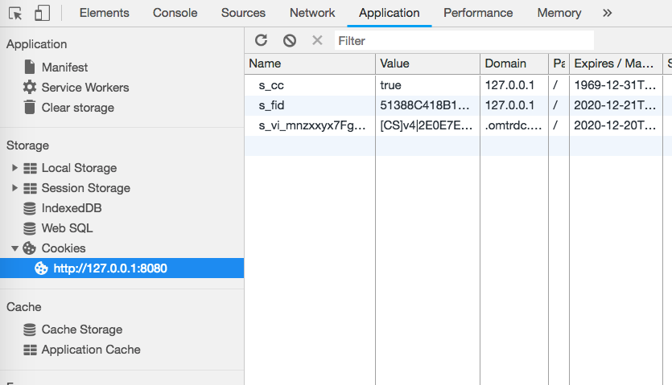

# Validation du service Opt-in{#validating-opt-in-service}

Une fois le service Opt-in activé sur votre site web, utilisez les différentes méthodes de validation afin de vérifier que celui-ci fonctionne correctement, à l’aide des outils de développement de votre navigateur.

## Cas d’utilisation 1 : Activation d’Opt-in {#section-c8fe1ee3711b420c8186c7057abbecb3}

```
Visitor.getInstance({{YOUR_ORG_ID}}, { 
    doesOptInApply: true 
});
```


Avant de charger la page, videz le cache et supprimez les cookies.

Dans Chrome, cliquez sur la page web avec le bouton droit de la souris, puis cliquez sur Inspecter. Comme montré sur la capture d’écran ci-dessus, sélectionnez l’onglet *Network* pour afficher les requêtes faites depuis le navigateur.

Dans l’exemple ci-dessus, les balises JS Adobe suivantes sont installées sur la page : ECID, AAM, Analytics et Target.

**Comment voir si Opt-in fonctionne comme prévu ?**

Aucune requête vers les serveurs Adobe suivants n’apparaît :

* demdex.net/id
* demdex.net/event
* omtrdc.net/b/ss
* omtrdc.net/m2
* everesttech.net

>[!NOTE]
>
>Vous devez voir un appel vers `http://dpm.demdex.net/optOutStatus`, un point de terminaison en LECTURE SEULE utilisé pour récupérer l’état de désinscription du visiteur. Ce point de terminaison n’entraîne pas la création de cookies tiers et ne collecte aucune information sur la page.

Aucun cookie ne doit avoir été créé par les balises Adobe : (AMCV_{{YOUR_ORG_ID}}, mbox, demdex, s_cc, s_sq, everest_g_v2, everest_session_v2)

Dans Chrome, accédez à l’onglet *Application*, développez la section *Cookies* sous *Storage* et sélectionnez le nom de domaine de votre site web :


## Cas d’utilisation 2 : Activation d’Opt-in et du stockage {#section-bd28326f52474fa09a2addca23ccdc0f}

```
Visitor.getInstance({{YOUR_ORG_ID}}, { 
    doesOptInApply: true, 
    isOptInStorageEnabled: true 
});
```

La seule différence avec le cas d’utilisation 2, c’est la présence d’*un nouveau cookie* contenant les autorisations d’Opt-in fournies par votre visiteur : **adobeujs-optin**.

## Cas d’utilisation 3 : Activation d’Opt-in et approbation préalable d’Adobe Analytics {#section-257fe582b425496cbf986d0ec12d3692}

```
var preApproveAnalytics = {}; 
preApproveAnalytics[adobe.OptInCategories.ANALYTICS] = true;

Visitor.getInstance({{YOUR_ORG_ID}}, { 
    doesOptInApply: true, 
    preOptInApprovals: preApproveAnalytics 
});
```

Lorsque l’Opt-in est préalablement approuvé pour Adobe Analytics, vous pouvez voir des requêtes dans l’onglet Network pour votre serveur de suivi :


et des cookies Analytics dans l’onglet Application :



## Cas d’utilisation 4 : Activation d’Opt-in et de l’IAB {#section-64331998954d4892960dcecd744a6d88}

```
Visitor.getInstance({{YOUR_ORG_ID}}, { 
    doesOptInApply: true, 
    isIabContext: true 
});
```

**Comment vérifier l’état actuel de votre consentement IAB sur la page ?**

Ouvrez les outils de développement, puis cliquez sur l’onglet *Console*. Collez le fragment de code suivant et appuyez sur Entrée :

```
<codeblock>
  __cmp("getVendorConsents", null, function (vendorConsents) { 
     console.log("Vendor Consent:", vendorConsents); }) 
</codeblock>  
  
```

Voici un exemple de sortie lorsque les points 1, 2 et 5, ainsi que l’ID fournisseur Audience Manager sont approuvés :

* demdex.net/id : La présence de cet appel montre qu’ECID a demandé un ID à partir de demdex.net.
* demdex.net/event : La présence de cet appel montre que l’appel de collecte des données DIL fonctionne comme prévu.
* demdex.net/dest5.html : La présence de cet appel montre que les synchronisations des identifiants sont déclenchées.


Si l’un des cas suivants n’est pas valide, aucune requête vers les serveurs Adobe et aucun cookie n’apparaissent.

* Les points 1, 2 ou 5 ne sont pas approuvés.
* L’ID fournisseur Audience Manager n’est pas approuvé.